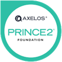
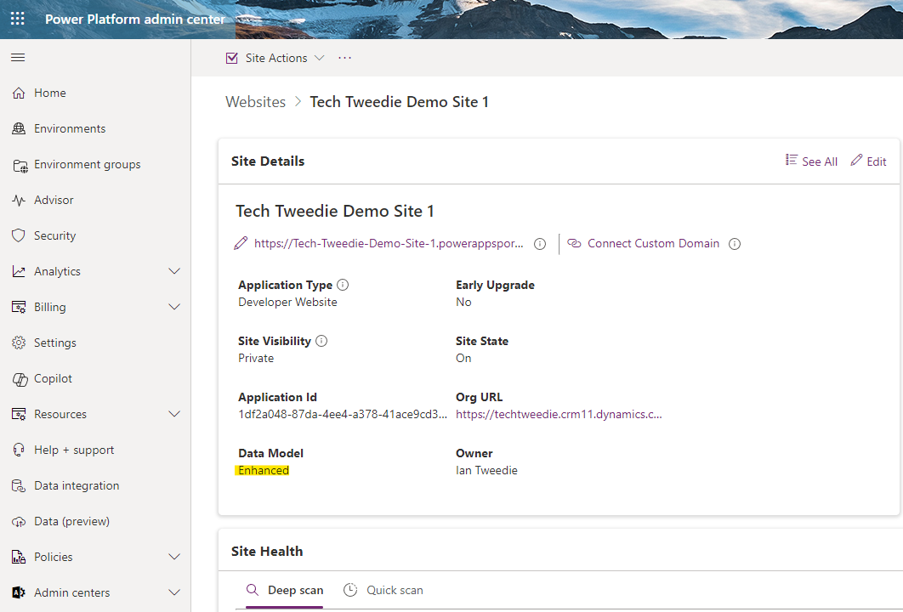

+++
title = "Are you backing up your build?"
description = "A Hugo theme for creating Reveal.js presentations"
outputs = ["Reveal"]
[reveal_hugo]
# Theme - https://revealjs.com/themes/
custom_theme = "css/techTweedieLight.css"
# theme = "white"
margin = 0.2
highlight_theme = "github"
transition = "convex"
transition_speed = "default"
slide_number = false
controlsTutorial = false
controls = false
center = false
touch = true
draft = false
[logo]
# https://reveal-hugo.dzello.com/logo-example/#/3
# src = "/techTweedie_150x150.png"
# alt = "techTweedie.github.io" # Alt text. 
# width = "100px" # Size of the file.
# Side info
# Transistion options: zoom, concave, convex, slide, fade, none
# Speed: slow, defualt, fast
+++

## Talk 2: Are you backing up your build?
PP/D365 Virtual User Group 
3rd October 2024


---


# Are you backing up your build?


---




- Ever wondered what would happen if you lost your development environment?
- How do you feel about having to do all of that work again?
- What about if you spot a problem days later?


---




- Do you all share one development enviroument? 
- Are you only pushing managed solutions up your pipeline?
- When was the last time you exported an unmanaged solution from your enviroument? 


---



# Ian Tweedie
<style>
.container{
    display: flex;
}
.col{
    flex: 1;
}
</style>

<div class="container">

<div class="col" style="justify-content: center; align-items: center;">

  

</div>


<div class="col">
  <ul>
    <li>Power Platform Technical Consultant, Capgemini</li>
    <li>Trustee for Digital Transformation for a chain alternative provision acadmey trust</li>
    <li>Chair of a Non for Profit Nursary</li>
  </ul>
</div>

</div>


---


### Ian Tweedie
##### Certifications



--- 


## 2x Certified Power Automate Connectors
<style>
.container{
    display: flex;
}
.col{
    flex: 1;
}
</style>

<div class="container">

<div class="col">

<div style="display: flex; justify-content: center; align-items: center;">
  <div style="flex: 20%; text-align: center;">
    
  </div>
  <div style="flex: 80%; text-align: left;">
    
  </div>
</div>

<ul>
  <li>Calculate working day</li>
  <li>Email domain checker</li>
</ul>
</div>

<div class="col">

</div>

</div>


---

## Community Content

<style>
.container{
    display: flex;
}
.col{
    flex: 1;
}
</style>

<div class="container">

<div class="col" >

  

</div>


<div class="col" >
  <ul>
    <li>techtweedie.github.io </li>
    <li>github.com/itweedie</li>
    <li>youtube.com/@techtweedie</li>
  </ul>
</div>

</div>

---

## Problem 

---



---

<section data-background-video="msedge_SKmWfLSaPu.mp4" data-background-video-muted>

</section>

---

## A Solution


---


## Pre-requisit 
- Dataverse System Admin
- DevOps Project Administrator
- [Azure DevOps Parallelism Request](https://aka.ms/azpipelines-parallelism-request)

---



<div style="background-color:  #F0F8FF; padding: 20px; margin-bottom: 20px; border-radius: 8px; box-shadow: 0 4px 8px rgba(0, 0, 0, 0.1);">

## Install Dataverse Build Tools

</div>

---

<section data-background-video="../msedge_EbORBUpsTl.mp4" data-background-video-muted>
</section>

---



<div style="background-color:  #F0F8FF; padding: 20px; margin-bottom: 20px; border-radius: 8px; box-shadow: 0 4px 8px rgba(0, 0, 0, 0.1);">

## App Regestration

**Client ID:** 
**Tenant ID:** 
**Secret:** 

</div>


---

<section data-background-video="brave_ODu5vMfo0o.mp4" data-background-video-muted>
</section>

---



<div style="background-color:  #F0F8FF; padding: 20px; margin-bottom: 20px; border-radius: 8px; box-shadow: 0 4px 8px rgba(0, 0, 0, 0.1);">

## Give Permission

</div>

---

<section data-background-video="msedge_eHL4W9sQv0.mp4" data-background-video-muted>
</section>

---




<div style="background-color:  #F0F8FF; padding: 20px; margin-bottom: 20px; border-radius: 8px; box-shadow: 0 4px 8px rgba(0, 0, 0, 0.1);">

## Create service connection


</div>

---

<section data-background-video="msedge_sZ1PzZV0rU.mp4" data-background-video-muted>
</section>

---



<div style="background-color:  #F0F8FF; padding: 20px; margin-bottom: 20px; border-radius: 8px; box-shadow: 0 4px 8px rgba(0, 0, 0, 0.1);">

**Client ID:** 

**Tenant ID:** 

**Secret:** 

**Server URL:**

</div>

---

<section data-background-video="msedge_Xe9SvGfBKl.mp4" data-background-video-muted>
</section>

---

<section data-background-video="msedge_pD2wxdy2fZ.mp4" data-background-video-muted>
</section>

---




<div style="background-color:  #F0F8FF; padding: 20px; margin-bottom: 20px; border-radius: 8px; box-shadow: 0 4px 8px rgba(0, 0, 0, 0.1);">

## Almost ready to go


</div>

---

<section data-background-video="../msedge_9mWYFGXubQ.mp4" data-background-video-muted>

</section>

---

<section data-background-video="../msedge_hHqXmiCb4i.mp4" data-background-video-muted>

</section>


---

<section data-background-video="../msedge_JIT24VboQm.mp4" data-background-video-muted>

</section>

---

<section data-background-video="../msedge_BlsWA591UT.mp4" data-background-video-muted>

</section>

---

<section data-background-video="../msedge_I0OyKYAnmJ.mp4" data-background-video-muted>

</section>

---

<section data-background-video="msedge_HcPwHJ3Jl2.mp4" data-background-video-muted>

</section>


---




<div style="background-color:  #F0F8FF; padding: 20px; margin-bottom: 20px; border-radius: 8px; box-shadow: 0 4px 8px rgba(0, 0, 0, 0.1);">

## We need to grab some more information
</div>


---

<section data-background-video="msedge_roryj0x4UE.mp4" data-background-video-muted>

</section>

---

<section data-background-video="msedge_5lVBUbV1eX.mp4" data-background-video-muted>

</section>

---



<div style="background-color:  #F0F8FF; padding: 20px; margin-bottom: 20px; border-radius: 8px; box-shadow: 0 4px 8px rgba(0, 0, 0, 0.1);">

## Powershell

```powershell
echo commit all changes
git config user.email "$(Build.RequestedForEmail)"
git config user.name "$(Build.RequestedFor)"
git checkout -b main
git add --all
git commit -m "Latest solution changes."
echo push code to new repo
git -c http.extraheader="AUTHORIZATION: bearer $(System.AccessToken)" push origin main      
```
</div>

---


<section data-background-video="msedge_tkGoo5YKFh.mp4" data-background-video-muted>

</section>


---


<section data-background-video="msedge_4XHoszBuKm.mp4" data-background-video-muted>

</section>


---



<div style="background-color:  #F0F8FF; padding: 20px; margin-bottom: 20px; border-radius: 8px; box-shadow: 0 4px 8px rgba(0, 0, 0, 0.1);">

## What error did we get

```CMD
You need the Git 'GenericContribute' permission to perform this action.
```

</div>

---

<section data-background-video="msedge_2YV6qxtrCc.mp4" data-background-video-muted>
</section>

---

<section data-background-video="msedge_kb0A45fFQH.mp4" data-background-video-muted>
</section>

---

<section data-background-video="msedge_9aHWdBDUYK.mp4" data-background-video-muted>
</section>

---

<section data-background-video="msedge_vUV2wXSN24.mp4" data-background-video-muted>
</section>

---

<section data-background-video="msedge_GQPGHdkLZy.mp4" data-background-video-muted>
</section>

---

<section data-background-video="msedge_A42h9JBHx2.mp4" data-background-video-muted>
</section>

---

<section data-background-video="msedge_EficgKeOrc.mp4" data-background-video-muted>
</section>

---

<section data-background-video="msedge_rDPbVsqvt7.mp4" data-background-video-muted>
</section>

---

<section data-background-video="msedge_UTkgQeXaaI.mp4" data-background-video-muted>
</section>

---

<section data-background-video="msedge_7xEESPsvQT.mp4" data-background-video-muted>
</section>


---



<div style="background-color: #F0F8FF; padding: 20px; margin-bottom: 20px; border-radius: 8px; box-shadow: 0 4px 8px rgba(0, 0, 0, 0.1);">



for **Data Model Enhanced** use Version **2**

</div>

---

<section data-background-video="msedge_lCGpcjkr1O.mp4" data-background-video-muted>
</section>

---

<section data-background-video="msedge_dELkUAQUCp.mp4" data-background-video-muted>
</section>

---

---


# Questions


--- 



# Ian Tweedie
<style>
.container{
    display: flex;
}
.col{
    flex: 1;
}
</style>

<div class="container">
  <div class="col" stype="justify-content: center; align-items: center;">
    <div>
    Keep in touch
    </div>
    <div>
    
    </div>
  </div>
  <div class="col" stype="justify-content: center; align-items: center;">
    <div>Feedback</div>
    <div></div>
  </div>
    <div class="col" stype="justify-content: center; align-items: center;">
    <div>Presentation</div>
    <div></div>
  </div>
</div>
