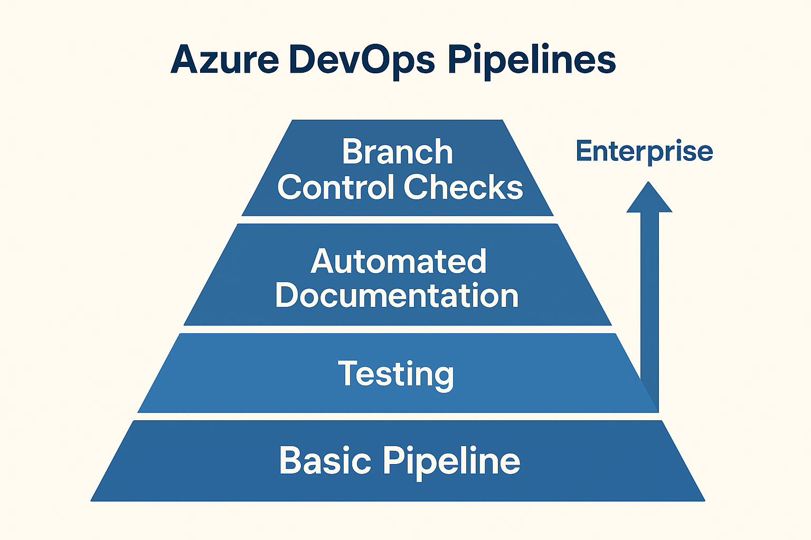
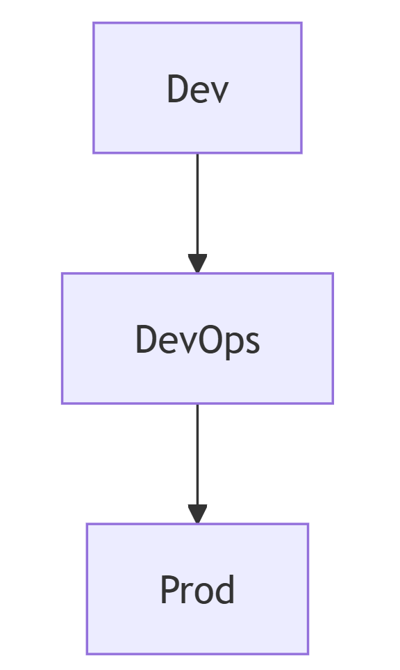
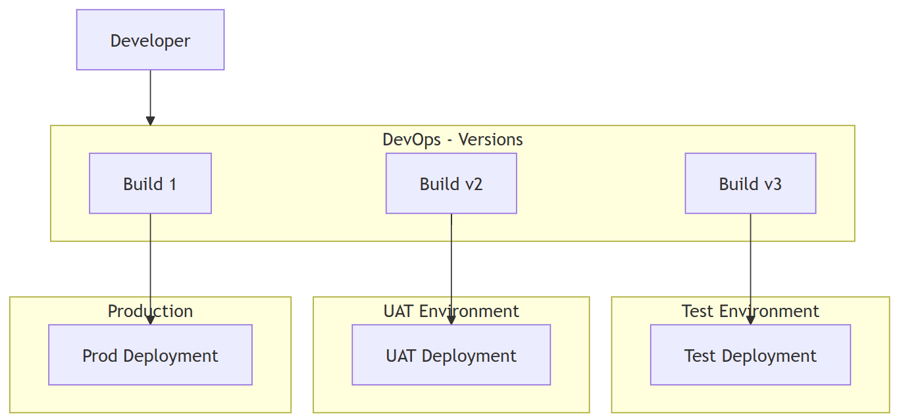
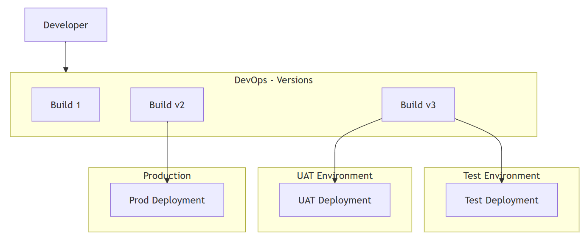
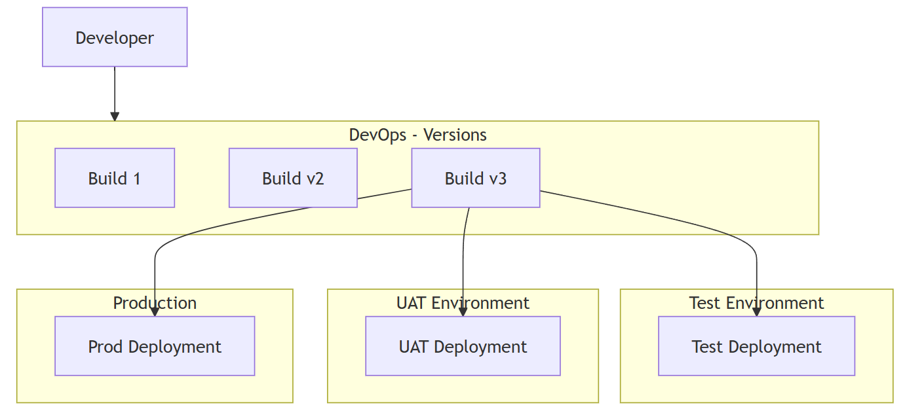

+++
title = "Build Your First DevOps Pipeline for the Power Platform"
description = "A hands-on, beginner-friendly session on building your first DevOps pipeline for the Power Platform"
outputs = ["Reveal"]
[reveal_hugo]
# Theme - https://revealjs.com/themes/
custom_theme = "css/techTweedieLight.css"
# theme = "white"
margin = 0.2
highlight_theme = "github"
transition = "convex"
transition_speed = "default"
slide_number = true
controlsTutorial = true
controls = true
center = false
touch = true
draft = false
background-image = "slides/UG/Slide3.PNG"
[logo]
# https://reveal-hugo.dzello.com/logo-example/#/3
# src = "/techTweedie_150x150.png"
# alt = "techTweedie.github.io" # Alt text. 
# width = "100px" # Size of the file.
# Side info
# Transition options: zoom, concave, convex, slide, fade, none
# Speed: slow, default, fast
+++

<style>
:root {
  --primary-color: #4B514F;
  --secondary-color: #3666FF;
  --accent-color: #742774;
  --success-color: #0D7F41;
  --info-color: #243A5E;
  --warning-color:rgb(0, 0, 0);
  --r-link-color: #3666FF;
  --r-link-color-hover: #742774;
  --r-selection-background-color: rgba(54, 102, 255, 0.3);
}

.reveal {
  font-family: "Segoe UI", "Segoe UI Symbol", "Segoe UI Emoji", "Segoe UI Historic", Tahoma, "Helvetica Neue", Helvetica, Arial, sans-serif;
}

.reveal h1, .reveal h2, .reveal h3, .reveal h4, .reveal h5, .reveal h6 {
  font-family: "Segoe UI", "Segoe UI Symbol", "Segoe UI Emoji", "Segoe UI Historic", Tahoma, "Helvetica Neue", Helvetica, Arial, sans-serif;
}

.reveal h1, .reveal h2, .reveal h3, .reveal h4, .reveal h5, .reveal h6 {
  font-family: "Segoe UI", "Segoe UI Symbol", "Segoe UI Emoji", "Segoe UI Historic", Tahoma, "Helvetica Neue", Helvetica, Arial, sans-serif;
  color: var(--secondary-color);
}

.reveal h1, .reveal h2 {
  font-family: "Segoe UI Semibold", "Segoe UI", "Segoe UI Symbol", "Segoe UI Emoji", "Segoe UI Historic", Tahoma, "Helvetica Neue", Helvetica, Arial, sans-serif;
  font-weight: 600;
}

.reveal h1 {
  color: var(--accent-color);
}

/* Alternating word colors for H1 and H2 */
.reveal h1 .info-word,
.reveal h2 .info-word {
  color: var(--info-color);
}

.reveal h1 .accent-word,
.reveal h2 .accent-word {
  color: var(--accent-color);
}

.reveal a {
  color: var(--secondary-color);
}

.reveal a:hover {
  color: var(--accent-color);
}

.reveal strong, .reveal b {
  color: var(--warning-color);
}

.reveal em, .reveal i {
  color: var(--accent-color);
}

.container{
    display: flex;
}
.col{
    flex: 1;
}
.highlight-box {
    background-color: rgba(54, 102, 255, 0.1);
    padding: 20px;
    margin-bottom: 20px;
    border-radius: 8px;
    box-shadow: 0 4px 8px rgba(0, 0, 0, 0.1);
    border-left: 5px solid var(--secondary-color);
}
.demo-box {
    background-color: rgba(13, 127, 65, 0.1);
    padding: 15px;
    margin: 10px 0;
    border-radius: 5px;
    border-left: 5px solid var(--success-color);
}
.warning-box {
    background-color: #FFF3CD;
    padding: 15px;
    margin: 10px 0;
    border-radius: 5px;
    border-left: 5px solid #ffc107;
}
.instruction-item {
    display: flex;
    align-items: center;
    margin: 15px 0;
    padding: 10px;
    background-color: rgba(54, 102, 255, 0.05);
    border-radius: 5px;
}
.instruction-item svg {
    margin-right: 15px;
    flex-shrink: 0;
}
.instruction-text {
    flex: 1;
}
.key-combo {
    background-color: var(--secondary-color);
    color: white;
    padding: 4px 8px;
    border-radius: 4px;
    font-family: monospace;
    font-size: 0.9em;
}
</style>

<script>
// Automatically alternate H1 and H2 word colors
document.addEventListener('DOMContentLoaded', function() {
    function alternateHeadingColors() {
        const headingElements = document.querySelectorAll('.reveal h1, .reveal h2');
        
        headingElements.forEach(heading => {
            // Skip if already processed or contains HTML
            if (heading.querySelector('.info-word, .accent-word') || heading.innerHTML.includes('<')) {
                return;
            }
            
            const text = heading.textContent;
            const words = text.split(' ');
            
            const coloredWords = words.map((word, index) => {
                const className = index % 2 === 0 ? 'info-word' : 'accent-word';
                return `<span class="${className}">${word}</span>`;
            });
            
            heading.innerHTML = coloredWords.join(' ');
        });
    }
    
    // Run initially
    alternateHeadingColors();
    
    // Re-run when slides change (for dynamically loaded content)
    if (window.Reveal) {
        Reveal.addEventListener('slidechanged', alternateHeadingColors);
        Reveal.addEventListener('ready', alternateHeadingColors);
    }
});
</script>


<section>

# How to Navigate This Presentation

<div class="highlight-box">
<h3>🎮 Controls</h3>

<div class="instruction-item">
<svg width="24" height="24" viewBox="0 0 24 24" fill="none" xmlns="http://www.w3.org/2000/svg">
<path d="M12 2L15.09 8.26L22 9L17 14L18.18 21L12 17.77L5.82 21L7 14L2 9L8.91 8.26L12 2Z" fill="var(--secondary-color)"/>
</svg>
<div class="instruction-text">
Use <span class="key-combo">←</span> <span class="key-combo">→</span> <span class="key-combo">↑</span> <span class="key-combo">↓</span> arrow keys to navigate
</div>
</div>

<div class="instruction-item">
<svg width="24" height="24" viewBox="0 0 24 24" fill="none" xmlns="http://www.w3.org/2000/svg">
<path d="M9 12l2 2 4-4m6 2a9 9 0 11-18 0 9 9 0 0118 0z" stroke="var(--success-color)" stroke-width="2" fill="none"/>
</svg>
<div class="instruction-text">
Press <span class="key-combo">Space</span> or <span class="key-combo">Enter</span> to go to next slide
</div>
</div>

<div class="instruction-item">
<svg width="24" height="24" viewBox="0 0 24 24" fill="none" xmlns="http://www.w3.org/2000/svg">
<path d="M21 21l-6-6m2-5a7 7 0 11-14 0 7 7 0 0114 0z" stroke="var(--accent-color)" stroke-width="2" fill="none"/>
</svg>
<div class="instruction-text">
Press <span class="key-combo">Esc</span> to see slide overview
</div>
</div>

<div class="instruction-item">
<svg width="24" height="24" viewBox="0 0 24 24" fill="none" xmlns="http://www.w3.org/2000/svg">
<path d="M15 10l4.553-2.276A1 1 0 0121 8.618v6.764a1 1 0 01-1.447.894L15 14M5 18h8a2 2 0 002-2V8a2 2 0 00-2-2H5a2 2 0 00-2 2v8a2 2 0 002 2z" stroke="var(--info-color)" stroke-width="2" fill="none"/>
</svg>
<div class="instruction-text">
Press <span class="key-combo">F</span> for fullscreen mode
</div>
</div>

<div class="instruction-item">
<svg width="24" height="24" viewBox="0 0 24 24" fill="none" xmlns="http://www.w3.org/2000/svg">
<path d="M8.228 9c.549-1.165 2.03-2 3.772-2 2.21 0 4 1.343 4 3 0 1-1 1.5-1 2.5V15m0 3h.01M21 12a9 9 0 11-18 0 9 9 0 0118 0z" stroke="var(--warning-color)" stroke-width="2" fill="none"/>
</svg>
<div class="instruction-text">
Press <span class="key-combo">?</span> to see all keyboard shortcuts
</div>
</div>

</div>

<aside class="notes">
  Instructions for users navigating later
</aside>

</section>

---

<section id="2-welcome" data-background-image="UG/Slide1.PNG" data-background-size="contain" data-background-position="center" data-background-repeat="no-repeat" data-transition="zoom">
</section>

---

<section  data-background-image="UG/Slide4.PNG" data-background-size="contain" data-background-position="center" data-background-repeat="no-repeat" data-transition="zoom">

# 🎯 WHY

<div class="highlight-box">

**Why DevOps?** No Manual deployments

</div>

</section>

---

<section  data-background-image="UG/Slide4.PNG" data-background-size="contain" data-background-position="center" data-background-repeat="no-repeat" data-transition="zoom">

# 🎯 WHY

<div class="highlight-box">

**Versions:** Keep versions and change history

</div>


</section>

---

<section  data-background-image="UG/Slide4.PNG" data-background-size="contain" data-background-position="center" data-background-repeat="no-repeat" data-transition="zoom">

# 🎯 WHY

<div class="highlight-box">

**Tickets:** You can link it to your tickets

</div>

</section>

---

<section  data-background-image="UG/Slide4.PNG" data-background-size="contain" data-background-position="center" data-background-repeat="no-repeat" data-transition="zoom">

# 🎯 WHY

<div class="highlight-box">

**Expendability:** Start simple and grow

</div>

</section>

---

<section  data-background-image="UG/Slide4.PNG" data-background-size="contain" data-background-position="center" data-background-repeat="no-repeat" data-transition="zoom">



</section>

---

<section  data-background-image="UG/Slide4.PNG" data-background-size="contain" data-background-position="center" data-background-repeat="no-repeat" data-transition="zoom">

# Today's Agenda

<div class="highlight-box">

### What We'll Cover

**5 Key Areas Over 40 Minutes**

1. **Why** - Understanding the Why *(5 mins)*
2. **Patterns** - How to apply *(5 mins)*
3. **Hands-On Demos** - Building Your First Pipeline *(30 mins)* 
4. **Resources** - Take Home Materials - QR Code *(3 mins)*
5. **Q&A** - Your Questions *(2 mins)*

</div>

</section>

---

<section data-background-image="UG/Slide2.PNG" data-background-size="contain" data-background-position="center" data-background-repeat="no-repeat" data-transition="convex">

</section>

---

<section data-background-image="UG/Slide3.PNG" data-background-size="contain" data-background-position="center" data-background-repeat="no-repeat" data-transition="convex">

<aside class="notes">
  iNTRO 1
</aside>

</section>

---

<section data-background-iframe="https://mightora.io" data-background-interactive="false" data-transition="zoom">

</section>

---

<section data-background-iframe="https://techtweedie.github.io/" data-background-interactive="false" data-transition="zoom">

</section>

---

<section data-background-image="image-9.png"  data-background-position="center" data-background-repeat="no-repeat">
</section>


# North East

</section>

---

<section data-background-image="UG/Slide4.PNG" data-background-size="contain" data-background-position="center" data-background-repeat="no-repeat">
</section>

# Your First Power Platform DevOps Pipeline Isn’t as Hard as You Think

</section>

---

<section data-background-image="UG/Slide4.PNG" data-background-size="contain" data-background-position="center" data-background-repeat="no-repeat">

## The Journey Starts Here

- You've exported a solution ✅
- Maybe even unpacked it ✅  
- **But what's next?** 🤔

</section>


---

<section  data-background-image="UG/Slide4.PNG" data-background-size="contain" data-background-position="center" data-background-repeat="no-repeat" data-transition="zoom">



</section>

---

<section  data-background-image="UG/Slide4.PNG" data-background-size="contain" data-background-position="center" data-background-repeat="no-repeat" data-transition="zoom">



</section>

---

<section  data-background-image="UG/Slide4.PNG" data-background-size="contain" data-background-position="center" data-background-repeat="no-repeat" data-transition="zoom">



</section>

---

<section  data-background-image="UG/Slide4.PNG" data-background-size="contain" data-background-position="center" data-background-repeat="no-repeat" data-transition="zoom">



</section>


---

<section data-background-image="UG/Slide4.PNG" data-background-size="contain" data-background-position="center" data-background-repeat="no-repeat">
</section>

## Prerequisites

<div class="warning-box">

**Before We Start**

</div>

- **Dataverse System Admin** privileges
- **Azure DevOps** project with basic license
- [Azure DevOps Parallelism Request](https://aka.ms/azpipelines-parallelism-request)

---

<section data-background-image="../msBuildTools.gif" data-background-size="contain" data-background-position="center" data-background-repeat="no-repeat">
</section>

<div style="background-color:  #F0F8FF; padding: 20px; margin-bottom: 20px; border-radius: 8px; box-shadow: 0 4px 8px rgba(0, 0, 0, 0.1);">

## Install Dataverse Build Tools

</div>

---

<section data-background-video="../msedge_EbORBUpsTl.mp4" data-background-video-muted data-background-size="contain" data-background-position="center" data-background-repeat="no-repeat">
</section>

---

<section data-background-image="brave_pUuYqm9d3z.png" data-background-size="contain" data-background-position="center" data-background-repeat="no-repeat">
</section>

<div style="background-color:  #F0F8FF; padding: 20px; margin-bottom: 20px; border-radius: 8px; box-shadow: 0 4px 8px rgba(0, 0, 0, 0.1);">

## App Registration

**Client ID:** 

**Tenant ID:** 

**Secret:** 

</div>

---

<section data-background-video="brave_ODu5vMfo0o.mp4" data-background-size="contain"  data-background-video-muted >
</section>

---

<section data-background-image="msedge_1ofQsOS12a.png" data-background-size="contain" data-background-position="center" data-background-repeat="no-repeat">
</section>

<div style="background-color:  #F0F8FF; padding: 20px; margin-bottom: 20px; border-radius: 8px; box-shadow: 0 4px 8px rgba(0, 0, 0, 0.1);">

## Give Permission

</div>

---

<section data-background-video="msedge_eHL4W9sQv0.mp4"  data-background-size="contain" data-background-video-muted>
</section>

---

<section data-background-image="image-1.png" data-background-size="contain" data-background-position="center" data-background-repeat="no-repeat">
</section>

<div style="background-color:  #F0F8FF; padding: 20px; margin-bottom: 20px; border-radius: 8px; box-shadow: 0 4px 8px rgba(0, 0, 0, 0.1);">

## Create service connection


</div>

---

<section data-background-video="msedge_sZ1PzZV0rU.mp4" data-background-video-muted data-background-size="contain" data-background-position="center" data-background-repeat="no-repeat"> 
</section>

---

<section data-background-image="msedge_npQM2NGwB4.png" data-background-size="contain" data-background-position="center" data-background-repeat="no-repeat">
</section>

<div style="background-color:  #F0F8FF; padding: 20px; margin-bottom: 20px; border-radius: 8px; box-shadow: 0 4px 8px rgba(0, 0, 0, 0.1);">

**Client ID:** 

**Tenant ID:** 

**Secret:** 

**Server URL:**

</div>

---

<section data-background-video="msedge_Xe9SvGfBKl.mp4" data-background-size="contain"  data-background-video-muted>
</section>

---

<section data-background-video="msedge_pD2wxdy2fZ.mp4" data-background-size="contain"  data-background-video-muted>
</section>


---

<section data-background-image="UG/Slide4.PNG" data-background-size="contain" data-background-position="center" data-background-repeat="no-repeat">
</section>

## Repository Structure

---

<section data-background-image="UG/Slide4.PNG" data-background-size="contain" data-background-position="center" data-background-repeat="no-repeat">
</section>

## Recommended Folder Structure

```
MyPowerPlatformProject/
├── solutions/
│   ├── src/
│   │   └── MySolution/
│   └── MySolution.zip
├── pipelines/
│   ├── export-solution.yml
│   ├── build-and-deploy-solution.yml
├── documentation/
└── README.md
```

---

<section data-background-image="UG/Slide4.PNG" data-background-size="contain" data-background-position="center" data-background-repeat="no-repeat">
</section>

## Demo 1: Creating Your First Pipeline

<div class="demo-box">

**Live Demo**: Setting up the export pipeline in Azure DevOps

- https://dev.azure.com/TechTweedie/Tutorials
- https://make.powerapps.com/environments/b50bfa1f-d077-e56f-aeaa-b9f92d3b79ad/solutions


</div>

---

### Export Pipeline YAML

*Make sure you give permission on the repo*

[](https://techtweedie.github.io/pattern/power-platform-export-to-devops-simple-pipeline/)

---

<section data-background-image="UG/Slide4.PNG" data-background-size="contain" data-background-position="center" data-background-repeat="no-repeat">
</section>

## Demo 2: Exploring an Unpacked Solution

<div class="demo-box">

**Live Demo**: Understanding the solution structure

</div>

---

<section data-background-image="UG/Slide4.PNG" data-background-size="contain" data-background-position="center" data-background-repeat="no-repeat">
</section>

## Demo 3: Deploy Solution

<div class="demo-box">

**Live Demo**: Deploy the solution


</div>

---

<section data-background-image="UG/Slide4.PNG" data-background-size="contain" data-background-position="center" data-background-repeat="no-repeat">
</section>

### Deploy Solution

[](https://techtweedie.github.io/pattern/power-platform-import-from-devops-simple-pipeline/)

---

<section data-background-image="UG/Slide4.PNG" data-background-size="contain" data-background-position="center" data-background-repeat="no-repeat">
</section>

## Common Challenges & Solutions

---

<section data-background-image="UG/Slide4.PNG" data-background-size="contain" data-background-position="center" data-background-repeat="no-repeat">
</section>

### Challenge: Large Solutions

<div class="warning-box">

**Problem**: 

Solution export times out

**Solution**: 

- Use `AsyncOperation: true`
- Increase `MaxAsyncWaitTime`
- Split large solutions

</div>

---

<section data-background-image="UG/Slide4.PNG" data-background-size="contain" data-background-position="center" data-background-repeat="no-repeat">
</section>

### Challenge: Connection References

<div class="warning-box">

**Problem**: 

Connections fail in target environment

**Solution**: 

- Use deployment settings files
- Parameterize connection references
- Update connections post-deployment

</div>

---

<section data-background-image="UG/Slide4.PNG" data-background-size="contain" data-background-position="center" data-background-repeat="no-repeat">
</section>

### Challenge: Environment Variables

<div class="warning-box">

**Problem**: 

Environment-specific values

**Solution**: 

- Use environment variables in solution
- Configure per environment
- Automate variable updates

</div>

---

<section data-background-image="UG/Slide4.PNG" data-background-size="contain" data-background-position="center" data-background-repeat="no-repeat">
</section>  

## What next

- **Automated testing** with Test Engine
- **Multi-solution** management
- **Branch strategies** for teams  
- **Release management**
- **Monitoring & alerting**

---

<section data-background-image="UG/Slide4.PNG" data-background-size="contain" data-background-position="center" data-background-repeat="no-repeat">
</section>

## Key Takeaways

---

<section data-background-image="UG/Slide4.PNG" data-background-size="contain" data-background-position="center" data-background-repeat="no-repeat">
</section>

## Remember

<div class="highlight-box">

**DevOps is a Journey, Not a Destination**

</div>

- ✅ Start with basic export/deploy
- ✅ Add source control
- ✅ Automate what you can
- ✅ Iterate and improve
- ✅ Share knowledge with team

---

<section data-background-image="UG/Slide4.PNG" data-background-size="contain" data-background-position="center" data-background-repeat="no-repeat">
</section>

## Resources

- [Power Platform CLI Documentation](https://docs.microsoft.com/en-us/power-platform/developer/cli/introduction)
- [Azure DevOps Power Platform Tasks](https://marketplace.visualstudio.com/items?itemName=microsoft-IsvExpTools.PowerPlatform-BuildTools)
- [Power Platform ALM Guide](https://docs.microsoft.com/en-us/power-platform/alm/)
- [Sample Templates](https://github.com/itweedie)

---

<section  data-background-image="UG/Slide4.PNG" data-background-size="contain" data-background-position="center" data-background-repeat="no-repeat" data-transition="zoom">

<div style="display: flex; justify-content: center; align-items: center; gap: 20px;">
  
  
</div>

</section>

---

<section data-background-image="UG/Slide4.PNG" data-background-size="contain" data-background-position="center" data-background-repeat="no-repeat">
</section>

# Questions? 

<div style="display: flex; justify-content: center; align-items: flex-start; gap: 40px; flex-wrap: nowrap; min-width: 480px;">
  <div style="text-align: center; flex: 0 0 auto;">
    <h4>Slides</h4>
    <a href="https://mars.mightora.io/yourls/250627" target="_blank">
      
    </a>
  </div>
  
  <div style="text-align: center; flex: 0 0 auto;">
    <h4>Connect</h4>
    <a href="https://iantweedie.biz" target="_blank">
    
    </a>
  </div>
</div>

---


<section data-background-image="UG/Slide5.PNG" data-background-size="contain" data-background-position="center" data-background-repeat="no-repeat">
</section>
