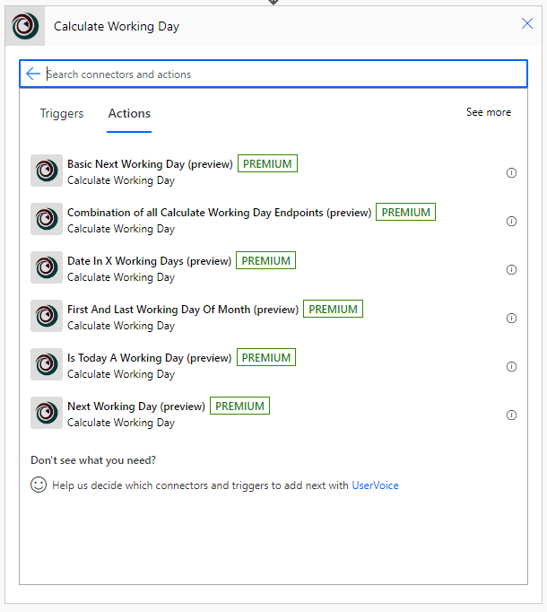

+++
title = "CustomReports"
description = "A Hugo theme for creating Reveal.js presentations"
outputs = ["Reveal"]
[reveal_hugo]
# Theme - https://revealjs.com/themes/
custom_theme = "css/techTweedieLight.css"
# theme = "white"
margin = 0.2
highlight_theme = "github"
transition = "convex"
transition_speed = "default"
slide_number = true
controlsTutorial = true
center = false
touch = true
[logo]
# https://reveal-hugo.dzello.com/logo-example/#/3
# src = "/techTweedie_150x150.png"
# alt = "techTweedie.github.io" # Alt text. 
# width = "100px" # Size of the file.
# Side info
# Transistion options: zoom, concave, convex, slide, fade, none
# Speed: slow, defualt, fast
+++


# **Enabling low code developers to:**
## Create custom client reports with a helping hand from Azure


---


## Introduction
- Use Power Automate to generate a custom report
- Based on Dataverse data
- Share it with our client securely via a link

---



# Ian Tweedie
<style>
.container{
    display: flex;
}
.col{
    flex: 1;
}
</style>

<div class="container">

<div class="col" style="justify-content: center; align-items: center;">

  

</div>


<div class="col">
  <ul>
    <li>Power Platform Technical Consultant, Capgemini</li>
    <li>Trustee for Digital Transformation for a chain alternative provision acadmey trust</li>
    <li>Chair of a Non for Profit Nursary</li>
  </ul>
</div>

</div>


---

### Ian Tweedie
##### Certifications


--- 

## 2x Certified Power Automate Connectors
<style>
.container{
    display: flex;
}
.col{
    flex: 1;
}
</style>

<div class="container">

<div class="col">

<div style="display: flex; justify-content: center; align-items: center;">
  <div style="flex: 20%; text-align: center;">
    
  </div>
  <div style="flex: 80%; text-align: left;">
    
  </div>
</div>

<ul>
  <li>Calculate working day</li>
  <li>Email domain checker</li>
</ul>
</div>

<div class="col">

</div>

</div>

---

## Community Content

<style>
.container{
    display: flex;
}
.col{
    flex: 1;
}
</style>

<div class="container">

<div class="col" >

  

</div>


<div class="col" >
  <ul>
    <li>https://techtweedie.github.io/ </li>
    <li>https://github.com/itweedie</li>
    <li>https://www.youtube.com/@techtweedie</li>
  </ul>
</div>

</div>

---

## Problem 
- We are are handling high value claims
- We need to share settlement documents with our clients
- The clients must access these documents securely 

---

{}

## Current solution
Demo 1

---

## Live Demo 1
1. [Settlement App](https://techtweedie.crm11.dynamics.com/main.aspx?appid=f49d2c8c-1232-ef11-8e4e-6045bd0d261b&pagetype=entityrecord&etn=techtwed_settlement&id=3272841e-6c32-ef11-8e4e-6045bd0d261b&formid=44e105a1-df32-ef11-8e4e-6045bd0d261b)
2. [Check email](https://outlook.office365.com/mail/demo@Tweed.technology/)
3. [Power automate flow](https://make.powerapps.com/environments/b50bfa1f-d077-e56f-aeaa-b9f92d3b79ad/solutions/d3bfeafe-1132-ef11-8e4e-6045bd0d261b/objects/cloudflows/25bc4d07-1da5-4c21-86bc-5ca9c7f9e994/view)

---



---



{}

---
## Problems

---
## Proposed solution
- Present it as a web link

---
## Can we
- Get power automate to make a web page for us
- Can that web page present a PDF document 


---


{}
# Lets give it a go
Demo 2

---

## Live Demo 2
1. [Web Page Flow](https://make.powerapps.com/environments/b50bfa1f-d077-e56f-aeaa-b9f92d3b79ad/solutions/d3bfeafe-1132-ef11-8e4e-6045bd0d261b/objects/cloudflows/25b74e7e-6734-4e38-9847-dc230c444aeb/view)
2. [Try it out](https://prod-16.uksouth.logic.azure.com/workflows/c59c21c2e87b4267a3f51327e8b0a9c6/triggers/manual/paths/invoke?api-version=2016-06-01&sp=%2Ftriggers%2Fmanual%2Frun&sv=1.0&sig=4o_YOe9rzXb6InvBIeOh3pM9GLXVfQOuR1GWuI81bVs)

---



---



{}

---

{}

## Key component

### Web Page

- Flow with HTTP Request trigger
- Response Headers 

```json
content-type : text/html
```

- Full list can be found [Common MIME types - HTTP | MDN (mozilla.org)](https://developer.mozilla.org/en-US/docs/Web/HTTP/Basics_of_HTTP/MIME_types/Common_types)

---




{}

---


{}
# Lets give it a go
Demo 3

---

## Live Demo 3
1. [PDF Flow](https://make.powerapps.com/environments/b50bfa1f-d077-e56f-aeaa-b9f92d3b79ad/solutions/d3bfeafe-1132-ef11-8e4e-6045bd0d261b/objects/cloudflows/53909a74-b04d-4ffd-9983-9b73d095e10c/view)
2. [Try it out](https://prod-21.uksouth.logic.azure.com/workflows/5ba0def50b7e43498b887e8aac99bfae/triggers/manual/paths/invoke?api-version=2016-06-01&sp=%2Ftriggers%2Fmanual%2Frun&sv=1.0&sig=wt-FxeMbuDM_UwFENGNdX-BGwFYX-u7hWtIqjw4Z5xQ)


---



{}

--- 

{}
## Key component

### PDF
- Response Headers 
```json
Content-Type: application/pdf
```
[Common MIME types - HTTP | MDN (mozilla.org)](https://developer.mozilla.org/en-US/docs/Web/HTTP/Basics_of_HTTP/MIME_types/Common_types)


```json
Content-Disposition: inline
Content-Disposition: attachment; filename="filename.pdf"
```
[Content-Disposition - HTTP | MDN (mozilla.org)](https://developer.mozilla.org/en-US/docs/Web/HTTP/Headers/Content-Disposition)

---



{}

---


{}
# Lets see that working
Demo 4

---

## Live Demo 4
1. [View Form](https://techtweedie.crm11.dynamics.com/main.aspx?appid=f49d2c8c-1232-ef11-8e4e-6045bd0d261b&pagetype=entityrecord&etn=techtwed_settlement&id=3272841e-6c32-ef11-8e4e-6045bd0d261b&formid=44e105a1-df32-ef11-8e4e-6045bd0d261b)
2. [Try it out](https://techtweedie.crm11.dynamics.com/main.aspx?appid=f49d2c8c-1232-ef11-8e4e-6045bd0d261b&pagetype=entityrecord&etn=techtwed_settlement&id=3272841e-6c32-ef11-8e4e-6045bd0d261b&formid=44e105a1-df32-ef11-8e4e-6045bd0d261b)
3. [View Flow](https://make.powerapps.com/environments/b50bfa1f-d077-e56f-aeaa-b9f92d3b79ad/solutions/d3bfeafe-1132-ef11-8e4e-6045bd0d261b/objects/cloudflows/a999aa73-d908-47b5-82c5-311a8814e270/view)


---



---



{}

---
## Key component

```csharp
@{triggerOutputs()['queries']}
```
---

### Overview


<div style="margin: 20px 0; transform: scale(2); margin-top: 150px;">


graph LR
    A(User) --> B(Flow) --> C(Dataverse)


</div>

---
### Sequence 

<div style="margin: 20px 0; transform: scale(1.2); margin-top: 50px;">


sequenceDiagram
    autonumber
    actor User
    User->>Flow: Clicks link HTTP
    Flow->>Dataverse: Requests data
    Dataverse-->>Flow: Data returned
    Flow->>SharePoint: Requests template
    SharePoint-->>Flow: Template returned
    Flow-->Flow: Merge data in to template
    Flow-->>User: Returns PDF


</div>


---
# We still have a problem


---

### What do we need?
    
  <div style="transform: scale(1.3); margin-top: 150px;">
  
  
  sequenceDiagram
      autonumber
      actor User
      User->>Flow: Clicks link
      Flow-->>User: Returns PDF
  
  </div>


---

### Reverse Proxy
<div style="transform: scale(1.3);  margin-top: 100px;">

sequenceDiagram
    autonumber
    actor User
    User->>Reverse-Proxy: Clicks link
    Reverse-Proxy-->>Reverse-Proxy: Authentication
    Reverse-Proxy->Flow: Forwards Request
    Flow-->>Reverse-Proxy: Returns PDF
    Reverse-Proxy-->>User: Returns PDF

</div>

---
### Solution requirements

- Authenticate by Azure B2C
- Reverse Proxy function

---
### Where can I find this

<style>
.container{
    display: flex;
}
.col{
    flex: 1;
}
</style>

<div class="container">

<div class="col" style="justify-content: center; align-items: center;">

  

</div>


<div class="col">
  <ul>
    <li>Out of the box Authentication Authentication</li>
  </ul>
</div>

</div>

--- 

# Azure App Service

---

# App Service

1. [shibayan/AppServiceProxy.SiteExtension: Site Extension-based Reverse Proxy compatible with Azure Functions Proxies (github.com)](https://github.com/shibayan/AppServiceProxy.SiteExtension)


1. Deploy it
2. [Configure it](https://app-ttdemo01a-bomg.scm.azurewebsites.net/dev/wwwroot/proxies.json)

---
# Lets look at the config

Demo 4


---
# Configuration of App Service

```JSON
{
  "$schema": "http://json.schemastore.org/proxies",
  "proxies": {
    "Demo01": {
      "matchCondition": {
        "methods": [ "GET" ],
        "route": "/Demo01/{*path}"
      },
      "backendUri": "https://prod-15.uksouth.logic.azure.com:443/workflows/7a854d30969e4158bac2b17ac15d1ad7/triggers/manual/paths/{path}"
    }
  }
} 
```

---
# Key component

## Inbound Header

```JSON
  "X-MS-CLIENT-PRINCIPAL-ID": "1ebcd192-5366-48eb-9028-04610ae1704d"
```

---
# Key component

## Fetch XML
```XML
<fetch>
  <entity name="techtwed_settlement">
    <attribute name="techtwed_name" />
    <attribute name="techtwed_settlementid" />
    <filter>
      <condition attribute="techtwed_name" operator="eq" value="SET-1001-T8B5" />
    </filter>
    <link-entity name="contact" from="contactid" to="techtwed_customer" alias="contact">
      <link-entity name="adx_externalidentity" from="adx_contactid" to="contactid" alias="externalid">
        <filter>
          <condition attribute="adx_username" operator="eq" value="1ebcd192-5366-48eb-9028-04610ae1704d" />
        </filter>
      </link-entity>
    </link-entity>
  </entity>
</fetch>
```
---
# High Level Solution



graph LR

    A[User] --> R[Reverse Proxy] --> B[Flow] --> C[Dataverse]


---
# Sequence Diagram


sequenceDiagram
    autonumber
    actor User
    
    User->>Reverse-Proxy: Click Link
    Reverse-Proxy->>Reverse-Proxy: Authentication
    Reverse-Proxy->>Flow: Forwards request
    Flow->>Dataverse: Requests data
    Dataverse-->>Flow: Data returned
    Flow->>SharePoint: Requests template
    SharePoint-->>Flow: Template returned
    Flow-->Flow: Merge data in to template
    Flow->>Reverse-Proxy: Returns PDF
    Reverse-Proxy->>User: Returns PDF


---
# Questions


--- 



# Ian Tweedie
<style>
.container{
    display: flex;
}
.col{
    flex: 1;
}
</style>

<div class="container">
  <div class="col" stype="justify-content: center; align-items: center;">
    <div>
    Keep in touch
    </div>
    <div>
    
    </div>
  </div>
  <div class="col" stype="justify-content: center; align-items: center;">
    <div>Feedback</div>
    <div></div>
  </div>
</div>

