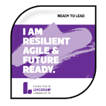

+++
title = "CustomReports"
description = "A Hugo theme for creating Reveal.js presentations"
outputs = ["Reveal"]
[reveal_hugo]
# Theme - https://revealjs.com/themes/
custom_theme = "css/techTweedieLight.css"
# theme = "white"
margin = 0.2
highlight_theme = "github"
transition = "convex"
transition_speed = "default"
slide_number = false
controls = false
controlsTutorial = false
center = false
touch = true
[logo]
# https://reveal-hugo.dzello.com/logo-example/#/3
src = "/techTweedie_150x150.png"
alt = "techTweedie.github.io" # Alt text. 
width = "100px" # Size of the file.
# Side info
# Transistion options: zoom, concave, convex, slide, fade, none
# Speed: slow, defualt, fast
# use for gif data-background-image 
# use for gif data-background-size
+++
<style>
.container {
    display: block;
    text-align: center; /* Center-aligns content */
}
.col{
    flex: 1;
}
.col ul li {
    position: relative;
    padding-left: 30px; /* Space for SVG icon */
    margin-bottom: 10px; /* Space between items */
    font-size: 1.1em; /* Slightly larger text */
    color: #333; /* Custom text color */
}
.cola img {
    display: block;
    margin: 0 auto; /* Centers image */
    width: 400px; /* Set desired width */
    height: auto; /* Maintains aspect ratio */
}
.cola ul {
    list-style-type: none; /* Removes default bullets */
    padding: 0; /* Removes default padding */
    margin-top: 15px; /* Space between image and list */
}
.cola ul li {
    position: relative;
    padding-left: 30px; /* Space for SVG icon */
    margin-bottom: 10px; /* Space between items */
    font-size: 1.1em; /* Slightly larger text */
    color: #333; /* Custom text color */
}
.cola ul li::before {
    content: '';
    position: absolute;
    left: 0;
    top: 50%;
    transform: translateY(-50%);
    width: 24px; /* Width of SVG icon */
    height: 24px; /* Height of SVG icon */
    background-image: url('data:image/svg+xml;utf8,<svg xmlns="http://www.w3.org/2000/svg" fill="none" viewBox="0 0 24 24" stroke-width="1.5" stroke="currentColor"><path stroke-linecap="round" stroke-linejoin="round" d="M7.217 10.907a2.25 2.25 0 1 0 0 2.186m0-2.186c.18.324.283.696.283 1.093s-.103.77-.283 1.093m0-2.186 9.566-5.314m-9.566 7.5 9.566 5.314m0 0a2.25 2.25 0 1 0 3.935 2.186 2.25 2.25 0 0 0-3.935-2.186Zm0-12.814a2.25 2.25 0 1 0 3.933-2.185 2.25 2.25 0 0 0-3.933 2.185Z" /></svg>');
    background-size: contain;
}

.aboutMe ul {
  list-style-type: none;
  padding: 0;
}

.aboutMe li {
  background-color: #f0f0f0;
  border-radius: 10px;
  padding: 10px;
  margin-bottom: 10px;
  width: 130%; /* Adjust the width as needed */
}

.bulletTwo ul {
  list-style-type: none;
  padding: 0;
}

.bulletTwo li {
  background-color: #f0f0f0;
  border-radius: 10px;
  padding: 10px;
  margin-bottom: 10px;
  width: 100%; /* Adjust the width as needed */
}
</style>




<h1 style="color: white; font-weight: bold; "> Enabling low code developers to </h1>


---


## Create custom client reports with a helping hand from Azure


---


## Introduction

<div class="col bulletTwo">
  <ul>
    <li class="fragment">Use Power Automate to generate a custom report</li>
    <li class="fragment">Based on Dataverse data</li>
    <li class="fragment">Share it with our client securely via a link</li>
  </ul>
</div>

---



# Ian Tweedie


<div class="container">

<div class="col" style="justify-content: center; align-items: center;">

  

</div>


<div class="col aboutMe">
  <ul>
    <li class="fragment">Power Platform Technical Consultant, Capgemini</li>
    <li class="fragment">Trustee for Digital Transformation for a £22 million non for profit</li>
    <li class="fragment">Chair of an £750k non for profit</li>
  </ul>
</div>

</div>


---

### Ian Tweedie
##### Certifications



--- 

## Community Tools


<div class="container">

  <div class="col">
    <div style="display: flex; justify-content: center; align-items: center;">
      <div style="flex: 20%; text-align: center;">
        
      </div>
      <div style="flex: 80%; text-align: left;">
        
      </div>
    </div>
    <ul>
      <li>Calculate working day</li>
      <li>Email domain checker</li>
      <li>Dataverse 4 Teams Local ALM Tool</li>
      <li>Around 1/2 a million hits a month</li>
    </ul>
  </div>

  <div class="col">
  
  </div>

</div>

---



<style>


</style>

<div class="container">
    <div class="cola">
        
        <br>
        <h2> Community Content </h2>
        <ul>
            <li><a href="https://techtweedie.github.io/"> techtweedie.github.io</a></li>
            <li><a href="https://www.youtube.com/@techtweedie"> youtube.com/@techtweedie</a></li>
        </ul>
    </div>
</div>


---


## Problem 

- **WE ARE** handling high value claims

- **WE NEED TO** share settlement documents with our clients

- **WE MUST** share these documents securely 

---
{}



## Current solution
Demo 1

---


## Live Demo 1
1. [Settlement App](https://techtweedie.crm11.dynamics.com/main.aspx?appid=f49d2c8c-1232-ef11-8e4e-6045bd0d261b&pagetype=entityrecord&etn=techtwed_settlement&id=3272841e-6c32-ef11-8e4e-6045bd0d261b&formid=44e105a1-df32-ef11-8e4e-6045bd0d261b)
2. [Check email](https://outlook.office365.com/mail/demo@Tweed.technology/)
3. [Power automate flow](https://make.powerapps.com/environments/b50bfa1f-d077-e56f-aeaa-b9f92d3b79ad/solutions/d3bfeafe-1132-ef11-8e4e-6045bd0d261b/objects/cloudflows/25bc4d07-1da5-4c21-86bc-5ca9c7f9e994/view)

{}

---

<section data-background-size="contain"  id="demo-1-video-a"  data-background-video="flowProxy-demo1-screen1.mp4" data-background-video-muted>
</section>

---

<section data-background-size="contain"  id="demo-1-video-b"  data-background-video="flowProxy-demo1-screen2.mp4" data-background-video-muted>
</section>


---



## Problems

<div class="container">
  

  <div class="col">
    <p class="fragment">Slow</p>
    <p class="fragment">Inaccessible</p>
    <p class="fragment">Clunky</p>
    <p class="fragment">Internal User Driven</p>
  </div>

</div>


---


## Proposed solution
- Present it as a web link

---


## Can we

- Get power automate to make a web page for us

- Can that web page present a PDF document 


---


{}
# Lets give it a go
Demo 2

---


## Live Demo 2
1. [Web Page Flow](https://make.powerapps.com/environments/b50bfa1f-d077-e56f-aeaa-b9f92d3b79ad/solutions/d3bfeafe-1132-ef11-8e4e-6045bd0d261b/objects/cloudflows/25b74e7e-6734-4e38-9847-dc230c444aeb/view)
2. [Try it out](https://prod-16.uksouth.logic.azure.com/workflows/c59c21c2e87b4267a3f51327e8b0a9c6/triggers/manual/paths/invoke?api-version=2016-06-01&sp=%2Ftriggers%2Fmanual%2Frun&sv=1.0&sig=4o_YOe9rzXb6InvBIeOh3pM9GLXVfQOuR1GWuI81bVs)

{}

---

<section data-background-size="contain"  data-background-video="flowProxy-demo2-screen1.mp4" id="demo-2-video-a" data-background-video-muted>
</section>

---

## Test it together


<a href="https://prod-16.uksouth.logic.azure.com/workflows/c59c21c2e87b4267a3f51327e8b0a9c6/triggers/manual/paths/invoke?api-version=2016-06-01&sp=%2Ftriggers%2Fmanual%2Frun&sv=1.0&sig=4o_YOe9rzXb6InvBIeOh3pM9GLXVfQOuR1GWuI81bVs" target="_blank">Try it out</a>


---

{}

## View the flow runs 

<a href="https://make.powerapps.com/environments/b50bfa1f-d077-e56f-aeaa-b9f92d3b79ad/solutions/d3bfeafe-1132-ef11-8e4e-6045bd0d261b/objects/cloudflows/25b74e7e-6734-4e38-9847-dc230c444aeb/view" target="_blank">View</a>


---

<section data-background-size="contain"  data-background-video="flowProxy-demo2-screen2.mp4" data-background-video-muted>
</section>

{}


---



## Key component

### Web Page

- Flow with HTTP Request trigger
- Response Headers 

```json
content-type : text/html
```

- Full list can be found [Common MIME types - HTTP | MDN (mozilla.org)](https://developer.mozilla.org/en-US/docs/Web/HTTP/Basics_of_HTTP/MIME_types/Common_types)

---


<section data-background-size="contain"  data-background-video="mime-types.mp4" data-background-video-muted>
</section>


---


{}
# Lets give it a go
Demo 3

---


## Live Demo 3
1. [PDF Flow](https://make.powerapps.com/environments/b50bfa1f-d077-e56f-aeaa-b9f92d3b79ad/solutions/d3bfeafe-1132-ef11-8e4e-6045bd0d261b/objects/cloudflows/53909a74-b04d-4ffd-9983-9b73d095e10c/view)
2. [Try it out](https://prod-21.uksouth.logic.azure.com/workflows/5ba0def50b7e43498b887e8aac99bfae/triggers/manual/paths/invoke?api-version=2016-06-01&sp=%2Ftriggers%2Fmanual%2Frun&sv=1.0&sig=wt-FxeMbuDM_UwFENGNdX-BGwFYX-u7hWtIqjw4Z5xQ)

{}

---

<section id="demo-3-video-screen1" data-background-size="contain"  data-background-video="flowProxy-demo3-screen1.mp4" data-background-video-muted>
</section>

---

## Test it together


<a href="https://prod-21.uksouth.logic.azure.com/workflows/5ba0def50b7e43498b887e8aac99bfae/triggers/manual/paths/invoke?api-version=2016-06-01&sp=/triggers/manual/run&sv=1.0&sig=wt-FxeMbuDM_UwFENGNdX-BGwFYX-u7hWtIqjw4Z5xQ" target="_blank">Try it out</a>

---

## View the flow run

<a href="https://make.powerapps.com/environments/b50bfa1f-d077-e56f-aeaa-b9f92d3b79ad/solutions/d3bfeafe-1132-ef11-8e4e-6045bd0d261b/objects/cloudflows/53909a74-b04d-4ffd-9983-9b73d095e10c/view" target="_blank">View</a>


--- 



## Key component

### PDF
- Response Headers 
```json
Content-Type: application/pdf
```
[Common MIME types - HTTP | MDN (mozilla.org)](https://developer.mozilla.org/en-US/docs/Web/HTTP/Basics_of_HTTP/MIME_types/Common_types)


```json
Content-Disposition: inline
Content-Disposition: attachment; filename="filename.pdf"
```
[Content-Disposition - HTTP | MDN (mozilla.org)](https://developer.mozilla.org/en-US/docs/Web/HTTP/Headers/Content-Disposition)

---




---


{}
# Lets see that working
Demo 4


---



---



{}

---


## Live Demo 4
[View Form](https://techtweedie.crm11.dynamics.com/main.aspx?appid=f49d2c8c-1232-ef11-8e4e-6045bd0d261b&pagetype=entityrecord&etn=techtwed_settlement&id=3272841e-6c32-ef11-8e4e-6045bd0d261b&formid=44e105a1-df32-ef11-8e4e-6045bd0d261b)

---

## Test it together


<a href="https://prod-07.uksouth.logic.azure.com/workflows/c9d2fb07972942a097d16a9ce324097d/triggers/manual/paths/invoke?api-version=2016-06-01&sp=%2Ftriggers%2Fmanual%2Frun&sv=1.0&sig=BAtG0IUyjXSVsMyeXTpq3GI7Zj4SGP6-ztUD4Rj_v58&row=SET-1000-R2R2" target="_blank">Try it out</a>

---

## View the Flow 

<a href="https://make.powerapps.com/environments/b50bfa1f-d077-e56f-aeaa-b9f92d3b79ad/solutions/d3bfeafe-1132-ef11-8e4e-6045bd0d261b/objects/cloudflows/a999aa73-d908-47b5-82c5-311a8814e270/view" target="_blank">View the flow</a>

---


## Key component

```csharp
@{triggerOutputs()['queries']}
```
---


### Overview


<div style="margin: 20px 0; transform: scale(2); margin-top: 150px;">


graph LR
    A(User) --> B(Flow) --> C(Dataverse)


</div>

---


### Sequence 

<div style="margin: 20px 0; transform: scale(1.2); margin-top: 50px;">


sequenceDiagram
    autonumber
    actor User
    User->>Flow: Clicks link HTTP
    Flow->>Dataverse: Requests data
    Dataverse-->>Flow: Data returned
    Flow->>SharePoint: Requests template
    SharePoint-->>Flow: Template returned
    Flow-->Flow: Merge data in to template
    Flow-->>User: Returns PDF


</div>


---


# We still have a problem


---


### What do we need?
    
  <div style="transform: scale(1.3); margin-top: 150px;">
  
  
  sequenceDiagram
      autonumber
      actor User
      User->>Flow: Clicks link
      Flow-->>User: Returns PDF
  
  </div>


---


### Reverse Proxy
<div style="transform: scale(1.3);  margin-top: 100px;">

sequenceDiagram
    autonumber
    actor User
    User->>Reverse-Proxy: Clicks link
    Reverse-Proxy-->>Reverse-Proxy: Authentication
    Reverse-Proxy->Flow: Forwards Request
    Flow-->>Reverse-Proxy: Returns PDF
    Reverse-Proxy-->>User: Returns PDF

</div>

---


### Solution requirements

- Authenticate by Azure B2C

- Reverse Proxy function

---


### Where can I find this

<style>
.container{
    display: flex;
}
.col{
    flex: 1;
}
</style>

<div class="container">

<div class="col" style="justify-content: center; align-items: center;">

  

</div>


<div class="col">
  Out of the box Authentication 
</div>

</div>


---



<div style="background-color: white; padding: 20px; margin-bottom: 20px; border-radius: 8px; box-shadow: 0 4px 8px rgba(0, 0, 0, 0.1);">

### Azure function
- Forwards all headers received from the incoming request.
- Adds custom header Flow-Key (from environment variables).
- Handles GET method.
- Appends query parameters from the incoming request to the external URL.

</div>

```

FLOW_URL=https://prod-21.uksouth.logic.azure.com/workflows/your-logic-app-url
FLOW_KEY=your-flow-key-value

```

---



### Lets deploy it

1. Fork it

---

<section data-background-size="contain"  data-background-video="flowProxy-azureFunction-screen1.mp4" data-background-video-muted>
</section>

---



### Lets deploy it

1. Fork it
2. Deploy it

---

<section data-background-size="contain"  data-background-video="flowProxy-azureFunction-screen2.mp4" data-background-video-muted>
</section>

---



### Lets deploy it

1. Fork it
2. Deploy it
3. Add Environment variables

```

FLOW_URL=https://prod-15.uksouth.logic.azure.com/workflows/7a854d30969e4158bac2b17ac15d1ad7/triggers/manual/paths/invoke?api-version=2016-06-01&sp=%2Ftriggers%2Fmanual%2Frun&sv=1.0&sig=FrLhWsuldO9AiPgF4ztcjuvjsSrBrJtlD5Mf17jjU_I 

FLOW_KEY=ABC123

```

---

<section data-background-size="contain"  data-background-video="flowProxy-azureFunction-screen3.mp4" data-background-video-muted>
</section>

---


### Lets deploy it

1. Fork it
2. Deploy it
3. Add Environment variables
4. Setup Azure B2C

---

<section data-background-size="contain"  data-background-video="flowProxy-azureFunction-screen4.mp4" data-background-video-muted>
</section>

---


# Lets see that working
Demo 5

---


## Live Demo 5
<a href="https://techtweedie.crm11.dynamics.com/main.aspx?appid=f49d2c8c-1232-ef11-8e4e-6045bd0d261b&pagetype=entityrecord&etn=techtwed_settlement&id=3272841e-6c32-ef11-8e4e-6045bd0d261b&formid=4225fbe1-7174-ef11-a670-000d3a0d2d37" target="_blank">View the form</a>

---

## Try it out
<a href="https://flowproxy1.azurewebsites.net/api/proxy/?row=SET-1000-R2R2" target="_blank">
    

</a>

```
Username: demo@tweed.technology
Password: TechTweedie1!
```

---

## View the flow 

<a href="https://make.powerapps.com/environments/b50bfa1f-d077-e56f-aeaa-b9f92d3b79ad/solutions/d3bfeafe-1132-ef11-8e4e-6045bd0d261b/objects/cloudflows/db720441-2e33-ef11-8e4e-6045bd0d261b/view" target="_blank">View the flow</a>


---


# Key component

## Inbound Header

```JSON
  "X-MS-CLIENT-PRINCIPAL-ID": "1ebcd192-5366-48eb-9028-04610ae1704d"
```

---


# Key component

## Fetch XML
```XML
<fetch>
  <entity name="techtwed_settlement">
    <attribute name="techtwed_name" />
    <attribute name="techtwed_settlementid" />
    <filter>
      <condition attribute="techtwed_name" operator="eq" value="SET-1001-T8B5" />
    </filter>
    <link-entity name="contact" from="contactid" to="techtwed_customer" alias="contact">
      <link-entity name="adx_externalidentity" from="adx_contactid" to="contactid" alias="externalid">
        <filter>
          <condition attribute="adx_username" operator="eq" value="1ebcd192-5366-48eb-9028-04610ae1704d" />
        </filter>
      </link-entity>
    </link-entity>
  </entity>
</fetch>
```

---


# As a flow chart
<div style="transform: scale(1.3);  margin-top: 100px;">

flowchart TD
    A[techtwed_settlement] -->|Link: to techtwed_customer| B[contact]
    B -->|Link: to contactid| C[adx_externalidentity]

    %% Attributes and Filters
    A -->|Attribute| A1[techtwed_name]
    A -->|Attribute| A2[techtwed_settlementid]
    A -->|Filter: techtwed_name = SET-1001-T8B5| A3[techtwed_name = SET-1001-T8B5]

    C -->|Filter: adx_username = 1ebcd192-5366-48eb-9028-04610ae1704d| C1[adx_username = 1ebcd192-5366-48eb-9028-04610ae1704d]

</div>

---


# High Level Solution

<div style="transform: scale(1.3);  margin-top: 100px;">

graph TD
 A[User] --> R[Reverse Proxy] --> B[Flow] --> C[Dataverse]

</div>

---


# Sequence Diagram


sequenceDiagram
    autonumber
    actor User
    
    User->>Reverse-Proxy: Click Link
    Reverse-Proxy->>Reverse-Proxy: Authentication
    Reverse-Proxy->>Flow: Forwards request
    Flow->>Dataverse: Requests data
    Dataverse-->>Flow: Data returned
    Flow->>SharePoint: Requests template
    SharePoint-->>Flow: Template returned
    Flow-->Flow: Merge data in to template
    Flow->>Reverse-Proxy: Returns PDF
    Reverse-Proxy->>User: Returns PDF


---


# Questions


<style>
.container{
    display: flex;
}
.col{
    flex: 1;
}
</style>

<div class="container">
  <div class="col" stype="justify-content: center; align-items: center;">
    <div>
    Keep in touch
    </div>
    <div>
    
    </div>
  </div>
  <div class="col" stype="justify-content: center; align-items: center;">
    <div>Feedback</div>
    <div></div>
  </div>
    <div class="col" stype="justify-content: center; align-items: center;">
    <div>Presentation</div>
    <div></div>
  </div>
      <div class="col" stype="justify-content: center; align-items: center;">
    <div>Github Repo</div>
    <div></div>
  </div>      
 
</div>

