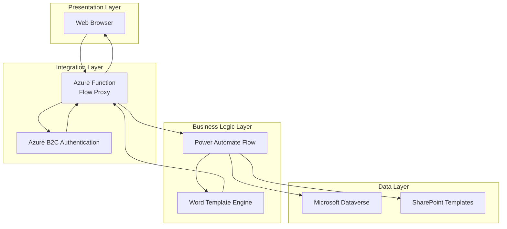
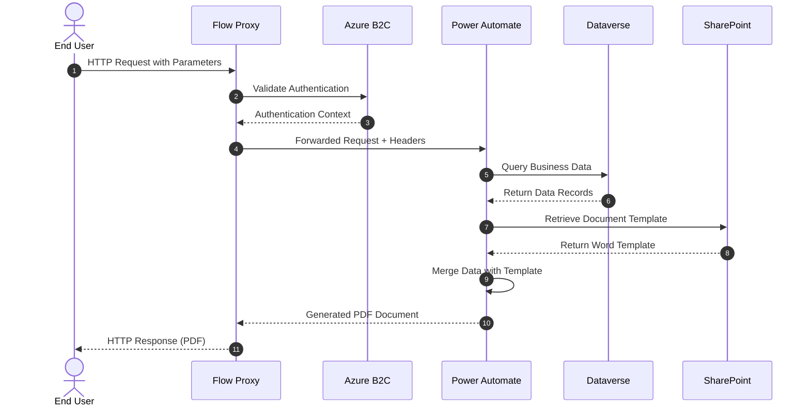
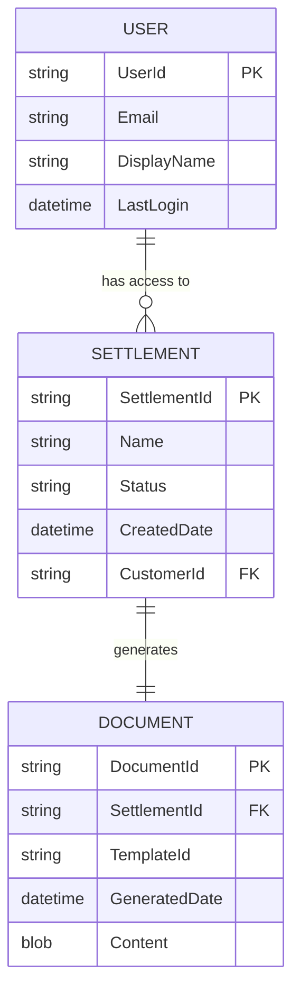
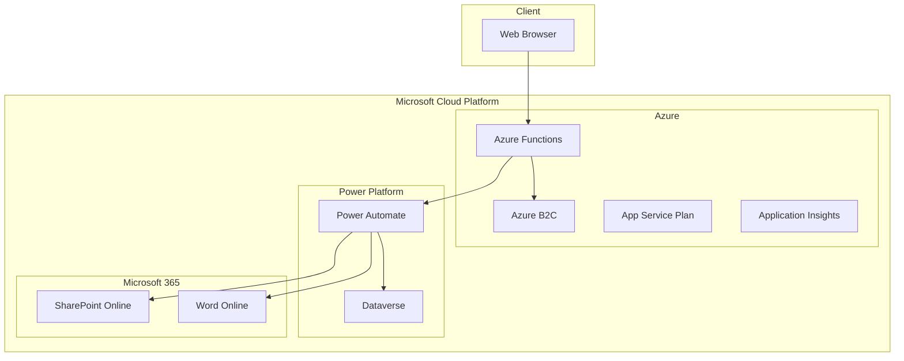
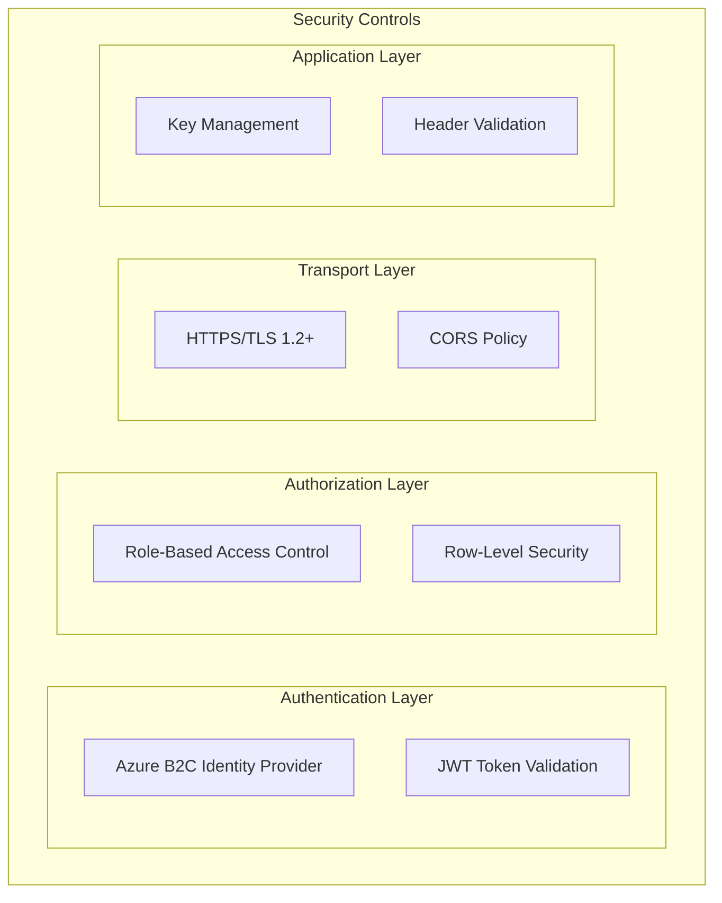
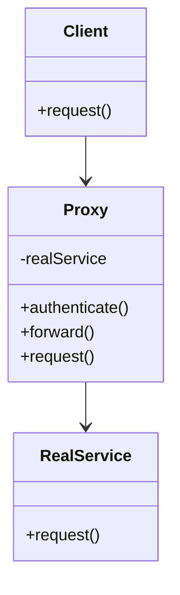
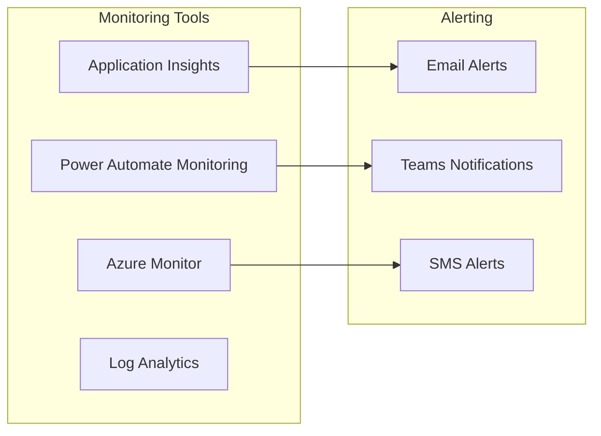

# Flow Proxy Architecture Pattern

## TOGAF Architectural Pattern Documentation

**Version:** 1.0  
**Date:** November 26, 2024  
**Author:** Ian Tweedie  
**Pattern Type:** Integration & Security Pattern  
**Classification:** Enterprise Architecture Pattern

---

## Executive Summary

The Flow Proxy Architecture Pattern provides a secure, scalable solution for generating and delivering custom reports through an authenticated web interface. This pattern addresses the challenge of securely exposing Power Platform automated document generation capabilities to end users while maintaining enterprise-grade security controls.

### Business Value
- **Cost Reduction**: Eliminates need for legacy system licenses while maintaining document generation capabilities
- **Security Enhancement**: Implements authentication and authorization controls for sensitive document access
- **User Experience**: Provides simple web-based access to generated documents
- **Scalability**: Leverages cloud-native services for automatic scaling

---

## 1. Architecture Vision

### 1.1 Business Context
Organizations often require secure access to dynamically generated documents based on database content. Traditional approaches involve complex user interfaces or direct system access, which can be costly and pose security risks.

### 1.2 Architecture Principles
- **Separation of Concerns**: Clear delineation between presentation, business logic, and data layers
- **Security by Design**: Authentication and authorization built into the architecture
- **Cloud-First**: Leverages Azure and Microsoft 365 cloud services
- **Minimal Viable Product**: Simple implementation with powerful capabilities
- **Stateless Design**: No server-side session management required

---

## 2. Business Architecture

### 2.1 Business Drivers
- **Legacy System Decommissioning**: Need to maintain document generation without expensive legacy licenses
- **Secure Document Access**: Requirement for authenticated access to sensitive documents
- **Process Automation**: Elimination of manual document generation processes
- **Cost Optimization**: Reduced operational costs through automation

### 2.2 Business Capabilities
- **Document Generation**: Automated creation of PDF documents from templates
- **User Authentication**: Secure user identification and authorization
- **Data Integration**: Connection to existing business data sources
- **Content Delivery**: Web-based document delivery mechanism

### 2.3 Stakeholders
- **End Users**: Frontline staff requiring access to generated documents
- **Business Analysts**: Defining document templates and data requirements
- **IT Security**: Ensuring compliance with security policies
- **System Administrators**: Managing and monitoring the solution

---

## 3. Information Systems Architecture

### 3.1 Application Architecture

#### 3.1.1 Application Components



#### 3.1.2 Component Responsibilities

| Component | Responsibility | Technology |
|-----------|---------------|------------|
| **Flow Proxy** | Request routing, header management, authentication integration | Azure Function |
| **Authentication Service** | User identity verification | Azure B2C |
| **Document Generator** | Template processing, data merging | Power Automate |
| **Template Engine** | Word document template processing | Office 365 |
| **Data Service** | Business data retrieval | Microsoft Dataverse |
| **Template Repository** | Document template storage | SharePoint |

### 3.2 Data Architecture

#### 3.2.1 Data Flow Diagram



#### 3.2.2 Data Entities



---

## 4. Technology Architecture

### 4.1 Platform Services

#### 4.1.1 Azure Services Stack



#### 4.1.2 Technology Stack Details

| Layer | Component | Technology | Version | Purpose |
|-------|-----------|------------|---------|---------|
| **Client** | Web Browser | Any Modern Browser | Current | Document access interface |
| **Security** | Authentication | Azure B2C | v2.0 | User identity management |
| **Integration** | Reverse Proxy | Azure Functions | v4.x | Request routing and security |
| **Process** | Automation Engine | Power Automate | Current | Document generation workflow |
| **Template** | Document Engine | Word Online | Current | Template processing |
| **Data** | Database | Microsoft Dataverse | Current | Business data storage |
| **Storage** | File Storage | SharePoint Online | Current | Template repository |
| **Monitoring** | Telemetry | Application Insights | Current | Performance monitoring |

### 4.2 Security Architecture

#### 4.2.1 Security Layers



#### 4.2.2 Security Controls Implementation

| Control Type | Implementation | Technology | Description |
|--------------|----------------|------------|-------------|
| **Identity** | Multi-tenant B2C | Azure B2C | User authentication and profile management |
| **Authentication** | OpenID Connect | OAuth 2.0/OIDC | Token-based authentication |
| **Authorization** | Claims-based | FetchXML queries | User-specific data filtering |
| **Transport** | SSL/TLS | HTTPS | Encrypted communication |
| **Application** | API Keys | Environment Variables | Service-to-service authentication |
| **Data** | Row-level filtering | Dataverse Security | User context-based data access |

---

## 5. Implementation Roadmap

### 5.1 Architecture Phases

#### Phase 1: Core Infrastructure (Weeks 1-2)
- [ ] Deploy Azure Function App
- [ ] Configure Azure B2C tenant
- [ ] Set up basic authentication flow
- [ ] Create Dataverse environment

#### Phase 2: Document Generation (Weeks 3-4)
- [ ] Design Word templates
- [ ] Implement Power Automate flows
- [ ] Configure SharePoint template storage
- [ ] Develop document generation logic

#### Phase 3: Integration & Security (Weeks 5-6)
- [ ] Implement Flow Proxy authentication
- [ ] Configure row-level security
- [ ] Set up monitoring and logging
- [ ] User acceptance testing

#### Phase 4: Production Deployment (Weeks 7-8)
- [ ] Production environment setup
- [ ] Performance optimization
- [ ] Security audit and penetration testing
- [ ] Go-live and user training

### 5.2 Architecture Decision Records (ADRs)

#### ADR-001: Azure Functions for Reverse Proxy
**Decision**: Use Azure Functions as the reverse proxy component  
**Rationale**: Native Azure integration, automatic scaling, minimal infrastructure overhead  
**Alternatives Considered**: Azure Application Gateway, NGINX on VM  
**Status**: Approved  

#### ADR-002: Power Automate for Document Generation
**Decision**: Use Power Automate for business logic and document generation  
**Rationale**: Low-code approach, native Office integration, business user maintainable  
**Alternatives Considered**: Custom .NET application, Logic Apps  
**Status**: Approved  

#### ADR-003: Azure B2C for Authentication
**Decision**: Implement Azure B2C for user authentication  
**Rationale**: Enterprise-grade identity management, customizable user journeys  
**Alternatives Considered**: Azure AD, custom authentication  
**Status**: Approved  

---

## 6. Architecture Patterns & Standards

### 6.1 Design Patterns Applied

#### 6.1.1 Proxy Pattern


**Implementation**: Azure Function acts as a proxy, handling authentication and forwarding requests to Power Automate flows.

#### 6.1.2 Template Method Pattern
**Implementation**: Word templates define the document structure, while Power Automate fills in dynamic content.

#### 6.1.3 Gateway Pattern
**Implementation**: Azure Function serves as an API gateway, providing a single entry point for external requests.

### 6.2 Integration Patterns

#### 6.2.1 Request-Reply Pattern
- Client sends HTTP request with query parameters
- Proxy validates authentication and forwards request
- Power Automate processes request and returns generated document
- Proxy returns document to client

#### 6.2.2 Content-Based Router Pattern
- Requests routed based on query parameters
- Different document types handled by different flows
- Dynamic routing based on user context

---

## 7. Non-Functional Requirements

### 7.1 Performance Requirements
- **Response Time**: Document generation < 30 seconds for typical use cases
- **Throughput**: Support 100 concurrent users
- **Scalability**: Auto-scale based on demand

### 7.2 Security Requirements
- **Authentication**: Multi-factor authentication support
- **Authorization**: Role-based access control
- **Data Protection**: Encryption in transit and at rest
- **Audit**: Complete audit trail of document access

### 7.3 Availability Requirements
- **Uptime**: 99.9% availability SLA
- **Recovery Time**: < 4 hours recovery time objective
- **Backup**: Daily automated backups
- **Disaster Recovery**: Cross-region replication

### 7.4 Compliance Requirements
- **Data Residency**: Data stored in specified geographic regions
- **GDPR**: Full compliance with data protection regulations
- **Industry Standards**: SOC 2 Type II compliance

---

## 8. Operations & Governance

### 8.1 Monitoring & Observability

#### 8.1.1 Key Performance Indicators (KPIs)
- Document generation success rate
- Average response time
- Authentication failure rate
- User adoption metrics

#### 8.1.2 Monitoring Stack


### 8.2 Governance Framework

#### 8.2.1 Change Management
- All changes reviewed by Architecture Review Board
- Automated testing required before production deployment
- Rollback procedures documented and tested

#### 8.2.2 Security Governance
- Quarterly security reviews
- Annual penetration testing
- Monthly access reviews

---

## 9. Risk Assessment & Mitigation

### 9.1 Technical Risks

| Risk | Likelihood | Impact | Mitigation Strategy |
|------|------------|--------|-------------------|
| **Service Dependencies** | Medium | High | Implement circuit breaker patterns, fallback mechanisms |
| **Authentication Failure** | Low | High | Multiple authentication providers, manual override procedures |
| **Performance Degradation** | Medium | Medium | Auto-scaling, performance monitoring, capacity planning |
| **Data Breach** | Low | High | End-to-end encryption, access controls, audit logging |

### 9.2 Business Risks

| Risk | Likelihood | Impact | Mitigation Strategy |
|------|------------|--------|-------------------|
| **User Adoption** | Medium | Medium | User training, change management, feedback collection |
| **Compliance Issues** | Low | High | Regular compliance audits, legal review, documentation |
| **Cost Overruns** | Medium | Low | Cost monitoring, usage alerts, budget controls |

---

## 10. Benefits Realization

### 10.1 Quantified Benefits

#### 10.1.1 Cost Savings
- **Legacy License Elimination**: $50,000 annually
- **Manual Process Reduction**: 40 hours/month saved
- **Infrastructure Costs**: 60% reduction vs. on-premises

#### 10.1.2 Operational Improvements
- **Document Generation Time**: Reduced from 15 minutes to 30 seconds
- **Error Rate**: 95% reduction in manual errors
- **User Satisfaction**: 40% improvement in user experience scores

### 10.2 Strategic Benefits
- **Digital Transformation**: Modernized legacy processes
- **Security Posture**: Enhanced security controls and compliance
- **Scalability**: Foundation for future automation initiatives
- **Innovation Platform**: Reusable pattern for other use cases

---

## 11. Conclusion

The Flow Proxy Architecture Pattern provides a robust, secure, and scalable solution for authenticated document generation and delivery. By leveraging cloud-native services and modern authentication patterns, this architecture delivers significant business value while maintaining enterprise-grade security and compliance requirements.

### Key Success Factors
1. **Clear separation of concerns** between authentication, business logic, and presentation
2. **Leverage of managed services** to reduce operational overhead
3. **Security-first design** with multiple layers of protection
4. **Scalable architecture** that can grow with business needs
5. **Maintainable solution** using low-code/no-code approaches where appropriate

### Recommended Next Steps
1. Conduct proof-of-concept implementation
2. Perform detailed security assessment
3. Develop comprehensive testing strategy
4. Plan user training and change management
5. Establish ongoing monitoring and maintenance procedures

---

## Appendices

### A. Technical Configuration Details

#### A.1 Azure Function Configuration
```json
{
  "FLOW_URL": "https://prod-xx.uksouth.logic.azure.com/workflows/{workflow-id}/triggers/manual/paths/invoke",
  "FLOW_KEY": "your-flow-key-value",
  "CORS_ORIGINS": "*",
  "FUNCTIONS_WORKER_RUNTIME": "node"
}
```

#### A.2 Power Automate Flow Configuration
```xml
<!-- FetchXML Example -->
<fetch>
  <entity name="settlement">
    <attribute name="name" />
    <attribute name="settlementid" />
    <filter>
      <condition attribute="name" operator="eq" value="@{triggerOutputs()['queries']['row']}" />
    </filter>
    <link-entity name="contact" from="contactid" to="customer">
      <link-entity name="externalidentity" from="contactid" to="contactid">
        <filter>
          <condition attribute="username" operator="eq" value="@{triggerOutputs()['headers']['X-MS-CLIENT-PRINCIPAL-ID']}" />
        </filter>
      </link-entity>
    </link-entity>
  </entity>
</fetch>
```

### B. Deployment Templates

#### B.1 Azure Resource Manager Template
Available at: [GitHub Repository](https://github.com/itweedie/AzureFunction-PowerAutomateProxy)

#### B.2 Environment Setup Checklist
- [ ] Azure subscription with appropriate permissions
- [ ] Power Platform environment
- [ ] Azure B2C tenant configuration
- [ ] SharePoint site for templates
- [ ] Dataverse environment setup

---

**Document Control**  
**Version History:**
- v1.0 - Initial version (November 26, 2024)

**Review Cycle:** Annual  
**Next Review Date:** November 26, 2025  
**Approved By:** Enterprise Architecture Review Board