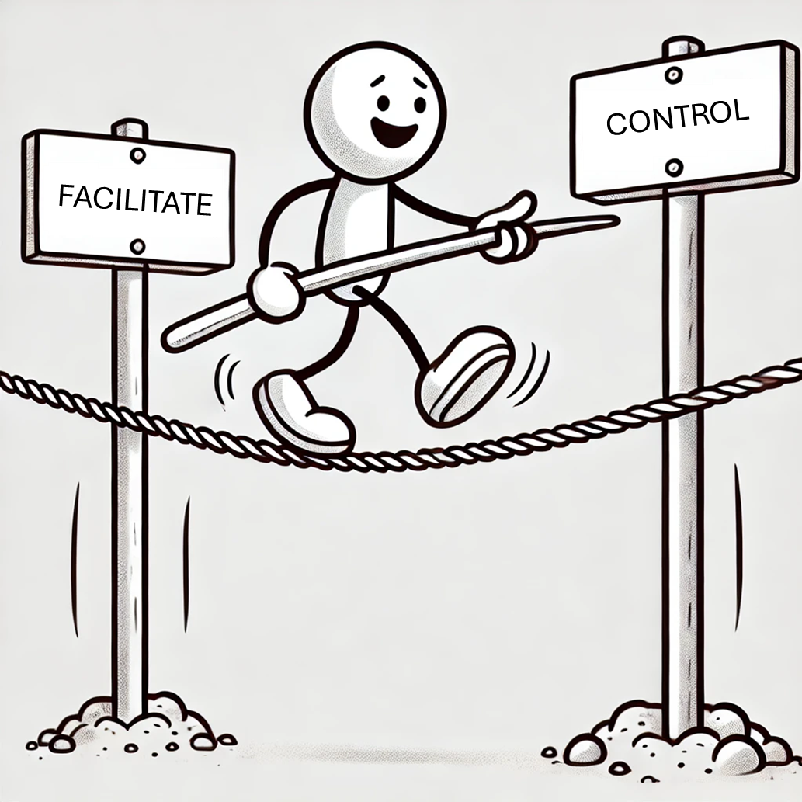

+++
title = "Tightrope of a Tech Lead"
description = "Tightrope of a Tech Lead"
outputs = ["Reveal"]
[reveal_hugo]
# Theme - https://revealjs.com/themes/
custom_theme = "css/techTweedieLight.css"
# theme = "white"
margin = 0.2
highlight_theme = "github"
transition = "convex"
transition_speed = "default"
slide_number = true
controls = true
controlsTutorial = false
center = false
touch = true
[logo]
# https://reveal-hugo.dzello.com/logo-example/#/3
src = "/techTweedie_150x150.png"
alt = "techTweedie.github.io" # Alt text. 
width = "50px" # Size of the file.
# Side info
# Transistion options: zoom, concave, convex, slide, fade, none
# Speed: slow, defualt, fast
# use for gif data-background-image 
# use for gif data-background-size
+++

# Tightrope of a Tech Lead {.r-fit-text}

---

# Tightrope of a Tech Lead {.r-fit-text}
 
 
 
 
{} ### Balance involvement? {}

 

{} ### Enough direction while allowing the team to grow? {}

---

## About Me {.r-fit-text}
 
  

{} ### **Ian Tweedie** {}
 
{} Senior Technical Consultant at Capgemini {}
 
{} Technical Architect {}

---

## Level of {.r-fit-text}
## direction {.r-fit-text}

---

## Balancing Involvement {.r-fit-text}

---

## Key Factors {.r-fit-text}

<section data-auto-animate>
</section>

<section data-auto-animate>
  <ul style="list-style: none; padding-left: 0;">
    <li style="padding: 10px 0;">
      <svg xmlns="http://www.w3.org/2000/svg" fill="none" viewBox="0 0 24 24" stroke-width="1.5" stroke="currentColor" class="size-1" style="vertical-align: middle; margin-right: 10px; width: 40px; height: 40px;">
        <path stroke-linecap="round" stroke-linejoin="round" d="m15 11.25-3-3m0 0-3 3m3-3v7.5M21 12a9 9 0 1 1-18 0 9 9 0 0 1 18 0Z" />
      </svg>
      Team relationships
    </li>
  </ul>
</section>

<section data-auto-animate>
  <ul style="list-style: none; padding-left: 0;">
    <li style="padding: 10px 0;">
      <svg xmlns="http://www.w3.org/2000/svg" fill="none" viewBox="0 0 24 24" stroke-width="1.5" stroke="currentColor" class="size-1" style="vertical-align: middle; margin-right: 10px; width: 40px; height: 40px;">
        <path stroke-linecap="round" stroke-linejoin="round" d="m15 11.25-3-3m0 0-3 3m3-3v7.5M21 12a9 9 0 1 1-18 0 9 9 0 0 1 18 0Z" />
      </svg>
      Team relationships
    </li>
    <li style="padding: 10px 0;">
      <svg xmlns="http://www.w3.org/2000/svg" fill="none" viewBox="0 0 24 24" stroke-width="1.5" stroke="currentColor" class="size-1" style="vertical-align: middle; margin-right: 10px; width: 40px; height: 40px;">
        <path stroke-linecap="round" stroke-linejoin="round" d="m15 11.25-3-3m0 0-3 3m3-3v7.5M21 12a9 9 0 1 1-18 0 9 9 0 0 1 18 0Z" />
      </svg>
      Experience level
    </li>
  </ul>
</section>

<section data-auto-animate>
  <ul style="list-style: none; padding-left: 0;">
    <li style="padding: 10px 0;">
      <svg xmlns="http://www.w3.org/2000/svg" fill="none" viewBox="0 0 24 24" stroke-width="1.5" stroke="currentColor" class="size-1" style="vertical-align: middle; margin-right: 10px; width: 40px; height: 40px;">
        <path stroke-linecap="round" stroke-linejoin="round" d="m15 11.25-3-3m0 0-3 3m3-3v7.5M21 12a9 9 0 1 1-18 0 9 9 0 0 1 18 0Z" />
      </svg>
      Team relationships
    </li>
    <li style="padding: 10px 0;">
      <svg xmlns="http://www.w3.org/2000/svg" fill="none" viewBox="0 0 24 24" stroke-width="1.5" stroke="currentColor" class="size-1" style="vertical-align: middle; margin-right: 10px; width: 40px; height: 40px;">
        <path stroke-linecap="round" stroke-linejoin="round" d="m15 11.25-3-3m0 0-3 3m3-3v7.5M21 12a9 9 0 1 1-18 0 9 9 0 0 1 18 0Z" />
      </svg>
      Experience level
    </li>
    <li style="padding: 10px 0;">
      <svg xmlns="http://www.w3.org/2000/svg" fill="none" viewBox="0 0 24 24" stroke-width="1.5" stroke="currentColor" class="size-1" style="vertical-align: middle; margin-right: 10px; width: 40px; height: 40px;">
        <path stroke-linecap="round" stroke-linejoin="round" d="m15 11.25-3-3m0 0-3 3m3-3v7.5M21 12a9 9 0 1 1-18 0 9 9 0 0 1 18 0Z" />
      </svg>
      Complexity of the solution
    </li>
  </ul>
</section>

<section data-auto-animate>
  <ul style="list-style: none; padding-left: 0;">
    <li style="padding: 10px 0;">
      <svg xmlns="http://www.w3.org/2000/svg" fill="none" viewBox="0 0 24 24" stroke-width="1.5" stroke="currentColor" class="size-1" style="vertical-align: middle; margin-right: 10px; width: 40px; height: 40px;">
        <path stroke-linecap="round" stroke-linejoin="round" d="m15 11.25-3-3m0 0-3 3m3-3v7.5M21 12a9 9 0 1 1-18 0 9 9 0 0 1 18 0Z" />
      </svg>
      Team relationships
    </li>
    <li style="padding: 10px 0;">
      <svg xmlns="http://www.w3.org/2000/svg" fill="none" viewBox="0 0 24 24" stroke-width="1.5" stroke="currentColor" class="size-1" style="vertical-align: middle; margin-right: 10px; width: 40px; height: 40px;">
        <path stroke-linecap="round" stroke-linejoin="round" d="m15 11.25-3-3m0 0-3 3m3-3v7.5M21 12a9 9 0 1 1-18 0 9 9 0 0 1 18 0Z" />
      </svg>
      Experience level
    </li>
    <li style="padding: 10px 0;">
      <svg xmlns="http://www.w3.org/2000/svg" fill="none" viewBox="0 0 24 24" stroke-width="1.5" stroke="currentColor" class="size-1" style="vertical-align: middle; margin-right: 10px; width: 40px; height: 40px;">
        <path stroke-linecap="round" stroke-linejoin="round" d="m15 11.25-3-3m0 0-3 3m3-3v7.5M21 12a9 9 0 1 1-18 0 9 9 0 0 1 18 0Z" />
      </svg>
      Complexity of the solution
    </li>
    <li style="padding: 10px 0;">
      <svg xmlns="http://www.w3.org/2000/svg" fill="none" viewBox="0 0 24 24" stroke-width="1.5" stroke="currentColor" class="size-1" style="vertical-align: middle; margin-right: 10px; width: 40px; height: 40px;">
        <path stroke-linecap="round" stroke-linejoin="round" d="m15 11.25-3-3m0 0-3 3m3-3v7.5M21 12a9 9 0 1 1-18 0 9 9 0 0 1 18 0Z" />
      </svg>
      Project length
    </li>
  </ul>
</section>

<section data-auto-animate>
  <ul style="list-style: none; padding-left: 0;">
    <li style="padding: 10px 0;">
      <svg xmlns="http://www.w3.org/2000/svg" fill="none" viewBox="0 0 24 24" stroke-width="1.5" stroke="currentColor" class="size-1" style="vertical-align: middle; margin-right: 10px; width: 40px; height: 40px;">
        <path stroke-linecap="round" stroke-linejoin="round" d="m15 11.25-3-3m0 0-3 3m3-3v7.5M21 12a9 9 0 1 1-18 0 9 9 0 0 1 18 0Z" />
      </svg>
      Team relationships
    </li>
    <li style="padding: 10px 0;">
      <svg xmlns="http://www.w3.org/2000/svg" fill="none" viewBox="0 0 24 24" stroke-width="1.5" stroke="currentColor" class="size-1" style="vertical-align: middle; margin-right: 10px; width: 40px; height: 40px;">
        <path stroke-linecap="round" stroke-linejoin="round" d="m15 11.25-3-3m0 0-3 3m3-3v7.5M21 12a9 9 0 1 1-18 0 9 9 0 0 1 18 0Z" />
      </svg>
      Experience level
    </li>
    <li style="padding: 10px 0;">
      <svg xmlns="http://www.w3.org/2000/svg" fill="none" viewBox="0 0 24 24" stroke-width="1.5" stroke="currentColor" class="size-1" style="vertical-align: middle; margin-right: 10px; width: 40px; height: 40px;">
        <path stroke-linecap="round" stroke-linejoin="round" d="m15 11.25-3-3m0 0-3 3m3-3v7.5M21 12a9 9 0 1 1-18 0 9 9 0 0 1 18 0Z" />
      </svg>
      Complexity of the solution
    </li>
    <li style="padding: 10px 0;">
      <svg xmlns="http://www.w3.org/2000/svg" fill="none" viewBox="0 0 24 24" stroke-width="1.5" stroke="currentColor" class="size-1" style="vertical-align: middle; margin-right: 10px; width: 40px; height: 40px;">
        <path stroke-linecap="round" stroke-linejoin="round" d="m15 11.25-3-3m0 0-3 3m3-3v7.5M21 12a9 9 0 1 1-18 0 9 9 0 0 1 18 0Z" />
      </svg>
      Project length
    </li>
    <li style="padding: 10px 0;">
      <svg xmlns="http://www.w3.org/2000/svg" fill="none" viewBox="0 0 24 24" stroke-width="1.5" stroke="currentColor" class="size-1" style="vertical-align: middle; margin-right: 10px; width: 40px; height: 40px;">
        <path stroke-linecap="round" stroke-linejoin="round" d="m15 11.25-3-3m0 0-3 3m3-3v7.5M21 12a9 9 0 1 1-18 0 9 9 0 0 1 18 0Z" />
      </svg>
      Regulatory constraints
    </li>
  </ul>
</section>

---

## Team Size {.r-fit-text}

<section data-auto-animate>
</section>

<section data-auto-animate>
<ul style="list-style: none; padding-left: 0;">
  <li style="padding: 10px 0;">
    <svg xmlns="http://www.w3.org/2000/svg" fill="none" viewBox="0 0 24 24" stroke-width="1.5" stroke="currentColor" class="size-1" style="vertical-align: middle; margin-right: 10px; width: 40px; height: 40px;">
      <path stroke-linecap="round" stroke-linejoin="round" d="m15 11.25-3-3m0 0-3 3m3-3v7.5M21 12a9 9 0 1 1-18 0 9 9 0 0 1 18 0Z" />
    </svg>
    Larger teams need <strong>more structure</strong>
  </li>
</ul>
</section>

<section data-auto-animate>
<ul style="list-style: none; padding-left: 0;">
  <li style="padding: 10px 0;">
    <svg xmlns="http://www.w3.org/2000/svg" fill="none" viewBox="0 0 24 24" stroke-width="1.5" stroke="currentColor" class="size-1" style="vertical-align: middle; margin-right: 10px; width: 40px; height: 40px;">
      <path stroke-linecap="round" stroke-linejoin="round" d="m15 11.25-3-3m0 0-3 3m3-3v7.5M21 12a9 9 0 1 1-18 0 9 9 0 0 1 18 0Z" />
    </svg>
    Larger teams need <strong>more structure</strong>
  </li>
  <li style="padding: 10px 0;">
    <svg xmlns="http://www.w3.org/2000/svg" fill="none" viewBox="0 0 24 24" stroke-width="1.5" stroke="currentColor" class="size-1" style="vertical-align: middle; margin-right: 10px; width: 40px; height: 40px;">
      <path stroke-linecap="round" stroke-linejoin="round" d="m15 11.25-3-3m0 0-3 3m3-3v7.5M21 12a9 9 0 1 1-18 0 9 9 0 0 1 18 0Z" />
    </svg>
    <strong>Process loss</strong> – Too many people working on the same thing
  </li>
</ul>
</section>

<section data-auto-animate>
<ul style="list-style: none; padding-left: 0;">
  <li style="padding: 10px 0;">
    <svg xmlns="http://www.w3.org/2000/svg" fill="none" viewBox="0 0 24 24" stroke-width="1.5" stroke="currentColor" class="size-1" style="vertical-align: middle; margin-right: 10px; width: 40px; height: 40px;">
      <path stroke-linecap="round" stroke-linejoin="round" d="m15 11.25-3-3m0 0-3 3m3-3v7.5M21 12a9 9 0 1 1-18 0 9 9 0 0 1 18 0Z" />
    </svg>
    Larger teams need <strong>more structure</strong>
  </li>
  <li style="padding: 10px 0;">
    <svg xmlns="http://www.w3.org/2000/svg" fill="none" viewBox="0 0 24 24" stroke-width="1.5" stroke="currentColor" class="size-1" style="vertical-align: middle; margin-right: 10px; width: 40px; height: 40px;">
      <path stroke-linecap="round" stroke-linejoin="round" d="m15 11.25-3-3m0 0-3 3m3-3v7.5M21 12a9 9 0 1 1-18 0 9 9 0 0 1 18 0Z" />
    </svg>
    <strong>Process loss</strong> – Too many people working on the same thing
  </li>
  <li style="padding: 10px 0;">
    <svg xmlns="http://www.w3.org/2000/svg" fill="none" viewBox="0 0 24 24" stroke-width="1.5" stroke="currentColor" class="size-1" style="vertical-align: middle; margin-right: 10px; width: 40px; height: 40px;">
      <path stroke-linecap="round" stroke-linejoin="round" d="m15 11.25-3-3m0 0-3 3m3-3v7.5M21 12a9 9 0 1 1-18 0 9 9 0 0 1 18 0Z" />
    </svg>
    <strong>Pluralistic ignorance</strong> – No one speaks up
  </li>
</ul>
</section>

<section data-auto-animate>
<ul style="list-style: none; padding-left: 0;">
  <li style="padding: 10px 0;">
    <svg xmlns="http://www.w3.org/2000/svg" fill="none" viewBox="0 0 24 24" stroke-width="1.5" stroke="currentColor" class="size-1" style="vertical-align: middle; margin-right: 10px; width: 40px; height: 40px;">
      <path stroke-linecap="round" stroke-linejoin="round" d="m15 11.25-3-3m0 0-3 3m3-3v7.5M21 12a9 9 0 1 1-18 0 9 9 0 0 1 18 0Z" />
    </svg>
    Larger teams need <strong>more structure</strong>
  </li>
  <li style="padding: 10px 0;">
    <svg xmlns="http://www.w3.org/2000/svg" fill="none" viewBox="0 0 24 24" stroke-width="1.5" stroke="currentColor" class="size-1" style="vertical-align: middle; margin-right: 10px; width: 40px; height: 40px;">
      <path stroke-linecap="round" stroke-linejoin="round" d="m15 11.25-3-3m0 0-3 3m3-3v7.5M21 12a9 9 0 1 1-18 0 9 9 0 0 1 18 0Z" />
    </svg>
    <strong>Process loss</strong> – Too many people working on the same thing
  </li>
  <li style="padding: 10px 0;">
    <svg xmlns="http://www.w3.org/2000/svg" fill="none" viewBox="0 0 24 24" stroke-width="1.5" stroke="currentColor" class="size-1" style="vertical-align: middle; margin-right: 10px; width: 40px; height: 40px;">
      <path stroke-linecap="round" stroke-linejoin="round" d="m15 11.25-3-3m0 0-3 3m3-3v7.5M21 12a9 9 0 1 1-18 0 9 9 0 0 1 18 0Z" />
    </svg>
    <strong>Pluralistic ignorance</strong> – No one speaks up
  </li>
  <li style="padding: 10px 0;">
    <svg xmlns="http://www.w3.org/2000/svg" fill="none" viewBox="0 0 24 24" stroke-width="1.5" stroke="currentColor" class="size-1" style="vertical-align: middle; margin-right: 10px; width: 40px; height: 40px;">
      <path stroke-linecap="round" stroke-linejoin="round" d="m15 11.25-3-3m0 0-3 3m3-3v7.5M21 12a9 9 0 1 1-18 0 9 9 0 0 1 18 0Z" />
    </svg>
    <strong>Diffusion of responsibility</strong> – "Someone else will do it"
  </li>
</ul>
</section>

---

{}

## The Bottleneck Problem {.r-fit-text}

  <ul style="list-style: none; padding-left: 0;">
    <li style="padding: 10px 0;">
      <svg xmlns="http://www.w3.org/2000/svg" fill="none" viewBox="0 0 24 24" stroke-width="1.5" stroke="currentColor" class="size-4" style="vertical-align: middle; margin-right: 10px; width: 40px; height: 40px;">
        <path stroke-linecap="round" stroke-linejoin="round" d="M8.625 12a.375.375 0 1 1-.75 0 .375.375 0 0 1 .75 0Zm0 0H8.25m4.125 0a.375.375 0 1 1-.75 0 .375.375 0 0 1 .75 0Zm0 0H12m4.125 0a.375.375 0 1 1-.75 0 .375.375 0 0 1 .75 0Zm0 0h-.375M21 12c0 4.556-4.03 8.25-9 8.25a9.764 9.764 0 0 1-2.555-.337A5.972 5.972 0 0 1 5.41 20.97a5.969 5.969 0 0 1-.474-.065 4.48 4.48 0 0 0 .978-2.025c.09-.457-.133-.901-.467-1.226C3.93 16.178 3 14.189 3 12c0-4.556 4.03-8.25 9-8.25s9 3.694 9 8.25Z" />
      </svg>
      Over-reliance on the tech lead
    </li>
    <li style="padding: 10px 0;">
      <svg xmlns="http://www.w3.org/2000/svg" fill="none" viewBox="0 0 24 24" stroke-width="1.5" stroke="currentColor" class="size-4" style="vertical-align: middle; margin-right: 10px; width: 40px; height: 40px;">
        <path stroke-linecap="round" stroke-linejoin="round" d="M2.25 6 9 12.75l4.286-4.286a11.948 11.948 0 0 1 4.306 6.43l.776 2.898m0 0 3.182-5.511m-3.182 5.51-5.511-3.181" />
      </svg>
      Progress slows down
    </li>
    <li style="padding: 10px 0;">
      <svg xmlns="http://www.w3.org/2000/svg" fill="none" viewBox="0 0 24 24" stroke-width="1.5" stroke="currentColor" class="size-4" style="vertical-align: middle; margin-right: 10px; width: 40px; height: 40px;">
        <path stroke-linecap="round" stroke-linejoin="round" d="m21 7.5-2.25-1.313M21 7.5v2.25m0-2.25-2.25 1.313M3 7.5l2.25-1.313M3 7.5l2.25 1.313M3 7.5v2.25m9 3 2.25-1.313M12 12.75l-2.25-1.313M12 12.75V15m0 6.75 2.25-1.313M12 21.75V19.5m0 2.25-2.25-1.313m0-16.875L12 2.25l2.25 1.313M21 14.25v2.25l-2.25 1.313m-13.5 0L3 16.5v-2.25" />
      </svg>
      The team becomes fragile
    </li>
  </ul>

---

## Breaking the Bottleneck {.r-fit-text}

  <ul style="list-style: none; padding-left: 0;">
    <li style="padding: 10px 0;">
      <svg xmlns="http://www.w3.org/2000/svg" fill="none" viewBox="0 0 24 24" stroke-width="1.5" stroke="currentColor" class="size-4" style="vertical-align: middle; margin-right: 10px; width: 40px; height: 40px;">
        <path stroke-linecap="round" stroke-linejoin="round" d="M2.25 18 9 11.25l4.306 4.306a11.95 11.95 0 0 1 5.814-5.518l2.74-1.22m0 0-5.94-2.281m5.94 2.28-2.28 5.941" />
      </svg>
      <strong>Grow your way out of it</strong>
    </li>
    <li style="padding: 10px 0;">
      <svg xmlns="http://www.w3.org/2000/svg" fill="none" viewBox="0 0 24 24" stroke-width="1.5" stroke="currentColor" class="size-4" style="vertical-align: middle; margin-right: 10px; width: 40px; height: 40px;">
        <path stroke-linecap="round" stroke-linejoin="round" d="M18 7.5v3m0 0v3m0-3h3m-3 0h-3m-2.25-4.125a3.375 3.375 0 1 1-6.75 0 3.375 3.375 0 0 1 6.75 0ZM3 19.235v-.11a6.375 6.375 0 0 1 12.75 0v.109A12.318 12.318 0 0 1 9.374 21c-2.331 0-4.512-.645-6.374-1.766Z" />
      </svg>
      Push people outside their comfort zones
    </li>
    <li style="padding: 10px 0;">
      <svg xmlns="http://www.w3.org/2000/svg" fill="none" viewBox="0 0 24 24" stroke-width="1.5" stroke="currentColor" class="size-4" style="vertical-align: middle; margin-right: 10px; width: 40px; height: 40px;">
        <path stroke-linecap="round" stroke-linejoin="round" d="m12.75 15 3-3m0 0-3-3m3 3h-7.5M21 12a9 9 0 1 1-18 0 9 9 0 0 1 18 0Z" />
      </svg>
      Shift commitments 
    </li>
    <li style="padding: 10px 0;">
      <svg xmlns="http://www.w3.org/2000/svg" fill="none" viewBox="0 0 24 24" stroke-width="1.5" stroke="currentColor" class="size-4" style="vertical-align: middle; margin-right: 10px; width: 40px; height: 40px;">
        <path stroke-linecap="round" stroke-linejoin="round" d="M15.182 15.182a4.5 4.5 0 0 1-6.364 0M21 12a9 9 0 1 1-18 0 9 9 0 0 1 18 0ZM9.75 9.75c0 .414-.168.75-.375.75S9 10.164 9 9.75 9.168 9 9.375 9s.375.336.375.75Zm-.375 0h.008v.015h-.008V9.75Zm5.625 0c0 .414-.168.75-.375.75s-.375-.336-.375-.75.168-.75.375-.75.375.336.375.75Zm-.375 0h.008v.015h-.008V9.75Z" />
      </svg>
      Carefully introduce new people
    </li>
  </ul>

---

## Tactical Moves {.r-fit-text}

  <ul style="list-style: none; padding-left: 0;">
    <li style="padding: 10px 0;">
      <svg xmlns="http://www.w3.org/2000/svg" fill="none" viewBox="0 0 24 24" stroke-width="1.5" stroke="currentColor" class="size-4" style="vertical-align: middle; margin-right: 10px; width: 40px; height: 40px;">
        <path stroke-linecap="round" stroke-linejoin="round" d="M15 19.128a9.38 9.38 0 0 0 2.625.372 9.337 9.337 0 0 0 4.121-.952 4.125 4.125 0 0 0-7.533-2.493M15 19.128v-.003c0-1.113-.285-2.16-.786-3.07M15 19.128v.106A12.318 12.318 0 0 1 8.624 21c-2.331 0-4.512-.645-6.374-1.766l-.001-.109a6.375 6.375 0 0 1 11.964-3.07M12 6.375a3.375 3.375 0 1 1-6.75 0 3.375 3.375 0 0 1 6.75 0Zm8.25 2.25a2.625 2.625 0 1 1-5.25 0 2.625 2.625 0 0 1 5.25 0Z" />
      </svg>
      Identify the <strong>second-most knowledgeable person</strong>
    </li>
    <li style="padding: 10px 0;">
      <svg xmlns="http://www.w3.org/2000/svg" fill="none" viewBox="0 0 24 24" stroke-width="1.5" stroke="currentColor" class="size-4" style="vertical-align: middle; margin-right: 10px; width: 40px; height: 40px;">
        <path stroke-linecap="round" stroke-linejoin="round" d="M17.982 18.725A7.488 7.488 0 0 0 12 15.75a7.488 7.488 0 0 0-5.982 2.975m11.963 0a9 9 0 1 0-11.963 0m11.963 0A8.966 8.966 0 0 1 12 21a8.966 8.966 0 0 1-5.982-2.275M15 9.75a3 3 0 1 1-6 0 3 3 0 0 1 6 0Z" />
      </svg>
      Make them the go-to person
    </li>
    <li style="padding: 10px 0;">
      <svg xmlns="http://www.w3.org/2000/svg" fill="none" viewBox="0 0 24 24" stroke-width="1.5" stroke="currentColor" class="size-4" style="vertical-align: middle; margin-right: 10px; width: 40px; height: 40px;">
        <path stroke-linecap="round" stroke-linejoin="round" d="M19.5 12c0-1.232-.046-2.453-.138-3.662a4.006 4.006 0 0 0-3.7-3.7 48.678 48.678 0 0 0-7.324 0 4.006 4.006 0 0 0-3.7 3.7c-.017.22-.032.441-.046.662M19.5 12l3-3m-3 3-3-3m-12 3c0 1.232.046 2.453.138 3.662a4.006 4.006 0 0 0 3.7 3.7 48.656 48.656 0 0 0 7.324 0 4.006 4.006 0 0 0 3.7-3.7c.017-.22.032-.441.046-.662M4.5 12l3 3m-3-3-3 3" />
      </svg>
      Rotate responsibilities
    </li>
    <li style="padding: 10px 0;">
      <svg xmlns="http://www.w3.org/2000/svg" fill="none" viewBox="0 0 24 24" stroke-width="1.5" stroke="currentColor" class="size-4" style="vertical-align: middle; margin-right: 10px; width: 40px; height: 40px;">
        <path stroke-linecap="round" stroke-linejoin="round" d="M11.42 15.17 17.25 21A2.652 2.652 0 0 0 21 17.25l-5.877-5.877M11.42 15.17l2.496-3.03c.317-.384.74-.626 1.208-.766M11.42 15.17l-4.655 5.653a2.548 2.548 0 1 1-3.586-3.586l6.837-5.63m5.108-.233c.55-.164 1.163-.188 1.743-.14a4.5 4.5 0 0 0 4.486-6.336l-3.276 3.277a3.004 3.004 0 0 1-2.25-2.25l3.276-3.276a4.5 4.5 0 0 0-6.336 4.486c.091 1.076-.071 2.264-.904 2.95l-.102.085m-1.745 1.437L5.909 7.5H4.5L2.25 3.75l1.5-1.5L7.5 4.5v1.409l4.26 4.26m-1.745 1.437 1.745-1.437m6.615 8.206L15.75 15.75M4.867 19.125h.008v.008h-.008v-.008Z" />
      </svg>
      Use the <strong>driver/instructor</strong> model
    </li>
  </ul>

---

## Encourage Active Thinking {.r-fit-text}

<ul style="list-style: none; padding-left: 0;">
  <li style="padding: 10px 0;">
    <svg xmlns="http://www.w3.org/2000/svg" fill="none" viewBox="0 0 24 24" stroke-width="1.5" stroke="currentColor" class="size-4" style="vertical-align: middle; margin-right: 10px; width: 40px; height: 40px;">
      <path stroke-linecap="round" stroke-linejoin="round" d="M17.25 9.75 19.5 12m0 0 2.25 2.25M19.5 12l2.25-2.25M19.5 12l-2.25 2.25m-10.5-6 4.72-4.72a.75.75 0 0 1 1.28.53v15.88a.75.75 0 0 1-1.28.53l-4.72-4.72H4.51c-.88 0-1.704-.507-1.938-1.354A9.009 9.009 0 0 1 2.25 12c0-.83.112-1.633.322-2.396C2.806 8.756 3.63 8.25 4.51 8.25H6.75Z" />
    </svg>
    Ask the quiet ones for input
  </li>
  <li style="padding: 10px 0;">
    <svg xmlns="http://www.w3.org/2000/svg" fill="none" viewBox="0 0 24 24" stroke-width="1.5" stroke="currentColor" class="size-4" style="vertical-align: middle; margin-right: 10px; width: 40px; height: 40px;">
      <path stroke-linecap="round" stroke-linejoin="round" d="M18 18.72a9.094 9.094 0 0 0 3.741-.479 3 3 0 0 0-4.682-2.72m.94 3.198.001.031c0 .225-.012.447-.037.666A11.944 11.944 0 0 1 12 21c-2.17 0-4.207-.576-5.963-1.584A6.062 6.062 0 0 1 6 18.719m12 0a5.971 5.971 0 0 0-.941-3.197m0 0A5.995 5.995 0 0 0 12 12.75a5.995 5.995 0 0 0-5.058 2.772m0 0a3 3 0 0 0-4.681 2.72 8.986 8.986 0 0 0 3.74.477m.94-3.197a5.971 5.971 0 0 0-.94 3.197M15 6.75a3 3 0 1 1-6 0 3 3 0 0 1 6 0Zm6 3a2.25 2.25 0 1 1-4.5 0 2.25 2.25 0 0 1 4.5 0Zm-13.5 0a2.25 2.25 0 1 1-4.5 0 2.25 2.25 0 0 1 4.5 0Z" />
    </svg>
    Show <strong>visible support</strong> for their ideas
  </li>
  <li style="padding: 10px 0;">
    <svg xmlns="http://www.w3.org/2000/svg" fill="none" viewBox="0 0 24 24" stroke-width="1.5" stroke="currentColor" class="size-4" style="vertical-align: middle; margin-right: 10px; width: 40px; height: 40px;">
      <path stroke-linecap="round" stroke-linejoin="round" d="M18 7.5v3m0 0v3m0-3h3m-3 0h-3m-2.25-4.125a3.375 3.375 0 1 1-6.75 0 3.375 3.375 0 0 1 6.75 0ZM3 19.235v-.11a6.375 6.375 0 0 1 12.75 0v.109A12.318 12.318 0 0 1 9.374 21c-2.331 0-4.512-.645-6.374-1.766Z" />
    </svg>
    Leadership = Enabling others to decide
  </li>
</ul>

{}

---

## The Impact {.r-fit-text}

<section data-auto-animate>

</section>
<section data-auto-animate>
  <ul style="list-style: none; padding-left: 0;">
    <li style="padding: 10px 0;">
      <svg xmlns="http://www.w3.org/2000/svg" fill="none" viewBox="0 0 24 24" stroke-width="1.5" stroke="currentColor" class="size-4" style="vertical-align: middle; margin-right: 10px; width: 40px; height: 40px;">
        <path stroke-linecap="round" stroke-linejoin="round" d="M12 3v17.25m0 0c-1.472 0-2.882.265-4.185.75M12 20.25c1.472 0 2.882.265 4.185.75M18.75 4.97A48.416 48.416 0 0 0 12 4.5c-2.291 0-4.545.16-6.75.47m13.5 0c1.01.143 2.01.317 3 .52m-3-.52 2.62 10.726c.122.499-.106 1.028-.589 1.202a5.988 5.988 0 0 1-2.031.352 5.988 5.988 0 0 1-2.031-.352c-.483-.174-.711-.703-.59-1.202L18.75 4.971Zm-16.5.52c.99-.203 1.99-.377 3-.52m0 0 2.62 10.726c.122.499-.106 1.028-.589 1.202a5.989 5.989 0 0 1-2.031.352 5.989 5.989 0 0 1-2.031-.352c-.483-.174-.711-.703-.59-1.202L5.25 4.971Z" />
      </svg>
      Balance is <strong>essential</strong>, not optional
    </li>
  </ul>
</section>
<section data-auto-animate>
  <ul style="list-style: none; padding-left: 0;">
    <li style="padding: 10px 0;">
      <svg xmlns="http://www.w3.org/2000/svg" fill="none" viewBox="0 0 24 24" stroke-width="1.5" stroke="currentColor" class="size-4" style="vertical-align: middle; margin-right: 10px; width: 40px; height: 40px;">
        <path stroke-linecap="round" stroke-linejoin="round" d="M12 3v17.25m0 0c-1.472 0-2.882.265-4.185.75M12 20.25c1.472 0 2.882.265 4.185.75M18.75 4.97A48.416 48.416 0 0 0 12 4.5c-2.291 0-4.545.16-6.75.47m13.5 0c1.01.143 2.01.317 3 .52m-3-.52 2.62 10.726c.122.499-.106 1.028-.589 1.202a5.988 5.988 0 0 1-2.031.352 5.988 5.988 0 0 1-2.031-.352c-.483-.174-.711-.703-.59-1.202L18.75 4.971Zm-16.5.52c.99-.203 1.99-.377 3-.52m0 0 2.62 10.726c.122.499-.106 1.028-.589 1.202a5.989 5.989 0 0 1-2.031.352 5.989 5.989 0 0 1-2.031-.352c-.483-.174-.711-.703-.59-1.202L5.25 4.971Z" />
      </svg>
      Balance is <strong>essential</strong>, not optional
    </li>
    <li style="padding: 10px 0;">
      <svg xmlns="http://www.w3.org/2000/svg" fill="none" viewBox="0 0 24 24" stroke-width="1.5" stroke="currentColor" class="size-4" style="vertical-align: middle; margin-right: 10px; width: 40px; height: 40px;">
        <path stroke-linecap="round" stroke-linejoin="round" d="M9.879 7.519c1.171-1.025 3.071-1.025 4.242 0 1.172 1.025 1.172 2.687 0 3.712-.203.179-.43.326-.67.442-.745.361-1.45.999-1.45 1.827v.75M21 12a9 9 0 1 1-18 0 9 9 0 0 1 18 0Zm-9 5.25h.008v.008H12v-.008Z" />
      </svg>
      <strong>Good people don’t leave bad projects</strong>
    </li>
  </ul>
</section>
<section data-auto-animate>
  <ul style="list-style: none; padding-left: 0;">
    <li style="padding: 10px 0;">
      <svg xmlns="http://www.w3.org/2000/svg" fill="none" viewBox="0 0 24 24" stroke-width="1.5" stroke="currentColor" class="size-4" style="vertical-align: middle; margin-right: 10px; width: 40px; height: 40px;">
        <path stroke-linecap="round" stroke-linejoin="round" d="M12 3v17.25m0 0c-1.472 0-2.882.265-4.185.75M12 20.25c1.472 0 2.882.265 4.185.75M18.75 4.97A48.416 48.416 0 0 0 12 4.5c-2.291 0-4.545.16-6.75.47m13.5 0c1.01.143 2.01.317 3 .52m-3-.52 2.62 10.726c.122.499-.106 1.028-.589 1.202a5.988 5.988 0 0 1-2.031.352 5.988 5.988 0 0 1-2.031-.352c-.483-.174-.711-.703-.59-1.202L18.75 4.971Zm-16.5.52c.99-.203 1.99-.377 3-.52m0 0 2.62 10.726c.122.499-.106 1.028-.589 1.202a5.989 5.989 0 0 1-2.031.352 5.989 5.989 0 0 1-2.031-.352c-.483-.174-.711-.703-.59-1.202L5.25 4.971Z" />
      </svg>
      Balance is <strong>essential</strong>, not optional
    </li>
    <li style="padding: 10px 0;">
      <svg xmlns="http://www.w3.org/2000/svg" fill="none" viewBox="0 0 24 24" stroke-width="1.5" stroke="currentColor" class="size-4" style="vertical-align: middle; margin-right: 10px; width: 40px; height: 40px;">
        <path stroke-linecap="round" stroke-linejoin="round" d="M9.879 7.519c1.171-1.025 3.071-1.025 4.242 0 1.172 1.025 1.172 2.687 0 3.712-.203.179-.43.326-.67.442-.745.361-1.45.999-1.45 1.827v.75M21 12a9 9 0 1 1-18 0 9 9 0 0 1 18 0Zm-9 5.25h.008v.008H12v-.008Z" />
      </svg>
      <strong>Good people don’t leave bad projects</strong>
    </li>
    <li style="padding: 10px 0;">
      <svg xmlns="http://www.w3.org/2000/svg" fill="none" viewBox="0 0 24 24" stroke-width="1.5" stroke="currentColor" class="size-4" style="vertical-align: middle; margin-right: 10px; width: 40px; height: 40px;">
        <path stroke-linecap="round" stroke-linejoin="round" d="M12 9v3.75m-9.303 3.376c-.866 1.5.217 3.374 1.948 3.374h14.71c1.73 0 2.813-1.874 1.948-3.374L13.949 3.378c-.866-1.5-3.032-1.5-3.898 0L2.697 16.126ZM12 15.75h.007v.008H12v-.008Z" />
      </svg>
      They leave <strong>bad leadership</strong>
    </li>
  </ul>
</section>

---

## Final Thought {.r-fit-text}

<section data-auto-animate>
</section>
<section data-auto-animate>
  <ul style="list-style: none; padding-left: 0;">
    <li style="padding: 10px 0;">
      <svg xmlns="http://www.w3.org/2000/svg" fill="none" viewBox="0 0 24 24" stroke-width="1.5" stroke="currentColor" class="size-4" style="vertical-align: middle; margin-right: 10px; width: 40px; height: 40px;">
        <path stroke-linecap="round" stroke-linejoin="round" d="M21 11.25v8.25a1.5 1.5 0 0 1-1.5 1.5H5.25a1.5 1.5 0 0 1-1.5-1.5v-8.25M12 4.875A2.625 2.625 0 1 0 9.375 7.5H12m0-2.625V7.5m0-2.625A2.625 2.625 0 1 1 14.625 7.5H12m0 0V21m-8.625-9.75h18c.621 0 1.125-.504 1.125-1.125v-1.5c0-.621-.504-1.125-1.125-1.125h-18c-.621 0-1.125.504-1.125 1.125v1.5c0 .621.504 1.125 1.125 1.125Z" />
      </svg>
      Create an environment where staying is <strong>more rewarding</strong> than leaving
    </li>
</section>
<section data-auto-animate>
  <ul style="list-style: none; padding-left: 0;">
    <li style="padding: 10px 0;">
      <svg xmlns="http://www.w3.org/2000/svg" fill="none" viewBox="0 0 24 24" stroke-width="1.5" stroke="currentColor" class="size-4" style="vertical-align: middle; margin-right: 10px; width: 40px; height: 40px;">
        <path stroke-linecap="round" stroke-linejoin="round" d="M21 11.25v8.25a1.5 1.5 0 0 1-1.5 1.5H5.25a1.5 1.5 0 0 1-1.5-1.5v-8.25M12 4.875A2.625 2.625 0 1 0 9.375 7.5H12m0-2.625V7.5m0-2.625A2.625 2.625 0 1 1 14.625 7.5H12m0 0V21m-8.625-9.75h18c.621 0 1.125-.504 1.125-1.125v-1.5c0-.621-.504-1.125-1.125-1.125h-18c-.621 0-1.125.504-1.125 1.125v1.5c0 .621.504 1.125 1.125 1.125Z" />
      </svg>
      Create an environment where staying is <strong>more rewarding</strong> than leaving
    </li>
    <li style="padding: 10px 0;">
      <svg xmlns="http://www.w3.org/2000/svg" fill="none" viewBox="0 0 24 24" stroke-width="1.5" stroke="currentColor" class="size-4" style="vertical-align: middle; margin-right: 10px; width: 40px; height: 40px;">
        <path stroke-linecap="round" stroke-linejoin="round" d="M12 3v17.25m0 0c-1.472 0-2.882.265-4.185.75M12 20.25c1.472 0 2.882.265 4.185.75M18.75 4.97A48.416 48.416 0 0 0 12 4.5c-2.291 0-4.545.16-6.75.47m13.5 0c1.01.143 2.01.317 3 .52m-3-.52 2.62 10.726c.122.499-.106 1.028-.589 1.202a5.988 5.988 0 0 1-2.031.352 5.988 5.988 0 0 1-2.031-.352c-.483-.174-.711-.703-.59-1.202L18.75 4.971Zm-16.5.52c.99-.203 1.99-.377 3-.52m0 0 2.62 10.726c.122.499-.106 1.028-.589 1.202a5.989 5.989 0 0 1-2.031.352 5.989 5.989 0 0 1-2.031-.352c-.483-.174-.711-.703-.59-1.202L5.25 4.971Z" />
      </svg>
      Balance level of <strong>direction</strong>
    </li>
  </ul>
</section>
<section data-auto-animate>
  <ul style="list-style: none; padding-left: 0;">
    <li style="padding: 10px 0;">
      <svg xmlns="http://www.w3.org/2000/svg" fill="none" viewBox="0 0 24 24" stroke-width="1.5" stroke="currentColor" class="size-4" style="vertical-align: middle; margin-right: 10px; width: 40px; height: 40px;">
        <path stroke-linecap="round" stroke-linejoin="round" d="M21 11.25v8.25a1.5 1.5 0 0 1-1.5 1.5H5.25a1.5 1.5 0 0 1-1.5-1.5v-8.25M12 4.875A2.625 2.625 0 1 0 9.375 7.5H12m0-2.625V7.5m0-2.625A2.625 2.625 0 1 1 14.625 7.5H12m0 0V21m-8.625-9.75h18c.621 0 1.125-.504 1.125-1.125v-1.5c0-.621-.504-1.125-1.125-1.125h-18c-.621 0-1.125.504-1.125 1.125v1.5c0 .621.504 1.125 1.125 1.125Z" />
      </svg>
      Create an environment where staying is <strong>more rewarding</strong> than leaving
    </li>
    <li style="padding: 10px 0;">
      <svg xmlns="http://www.w3.org/2000/svg" fill="none" viewBox="0 0 24 24" stroke-width="1.5" stroke="currentColor" class="size-4" style="vertical-align: middle; margin-right: 10px; width: 40px; height: 40px;">
        <path stroke-linecap="round" stroke-linejoin="round" d="M12 3v17.25m0 0c-1.472 0-2.882.265-4.185.75M12 20.25c1.472 0 2.882.265 4.185.75M18.75 4.97A48.416 48.416 0 0 0 12 4.5c-2.291 0-4.545.16-6.75.47m13.5 0c1.01.143 2.01.317 3 .52m-3-.52 2.62 10.726c.122.499-.106 1.028-.589 1.202a5.988 5.988 0 0 1-2.031.352 5.988 5.988 0 0 1-2.031-.352c-.483-.174-.711-.703-.59-1.202L18.75 4.971Zm-16.5.52c.99-.203 1.99-.377 3-.52m0 0 2.62 10.726c.122.499-.106 1.028-.589 1.202a5.989 5.989 0 0 1-2.031.352 5.989 5.989 0 0 1-2.031-.352c-.483-.174-.711-.703-.59-1.202L5.25 4.971Z" />
      </svg>
      Balance level of <strong>direction</strong>
    </li>
    <li style="padding: 10px 0;">
      <svg xmlns="http://www.w3.org/2000/svg" fill="none" viewBox="0 0 24 24" stroke-width="1.5" stroke="currentColor" class="size-4" style="vertical-align: middle; margin-right: 10px; width: 40px; height: 40px;">
        <path stroke-linecap="round" stroke-linejoin="round" d="M9 12.75 11.25 15 15 9.75M21 12a9 9 0 1 1-18 0 9 9 0 0 1 18 0Z" />
      </svg>
      Walk the <strong>tightrope</strong>
    </li>
  </ul>
</section>

---

<section data-auto-animate>

# Thank You {.r-fit-text}

## Any questions? 

</section>
<section data-auto-animate data-auto-animate-duration="2" data-auto-animate-delay="0" >

# Thank You {.r-fit-text}

## Any questions? 

 
 

    
    

</section>